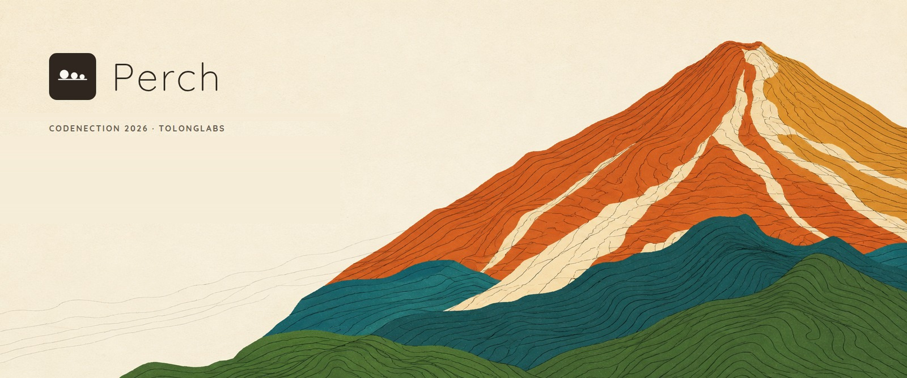
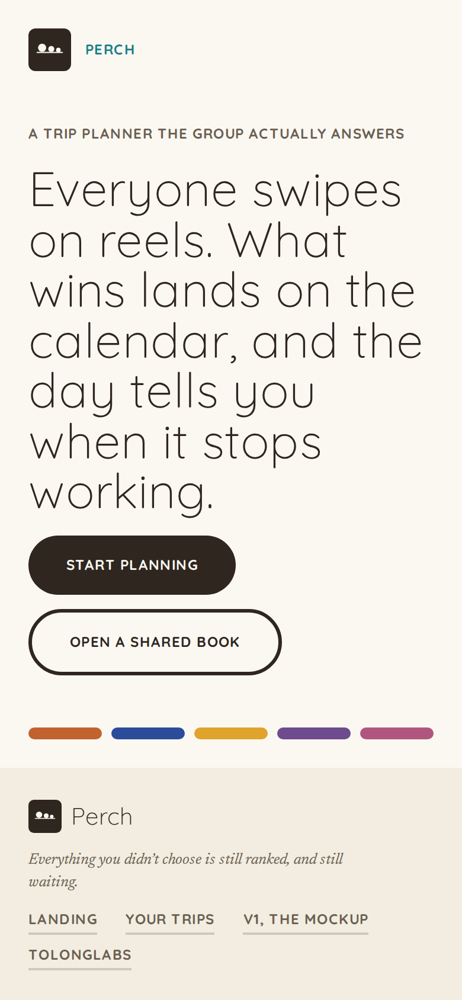
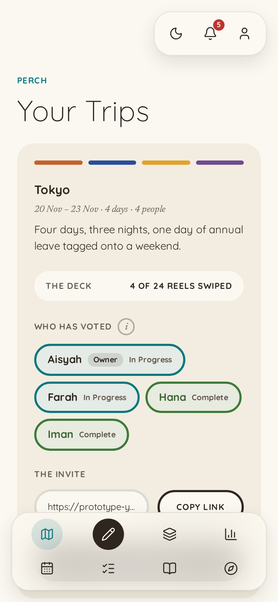
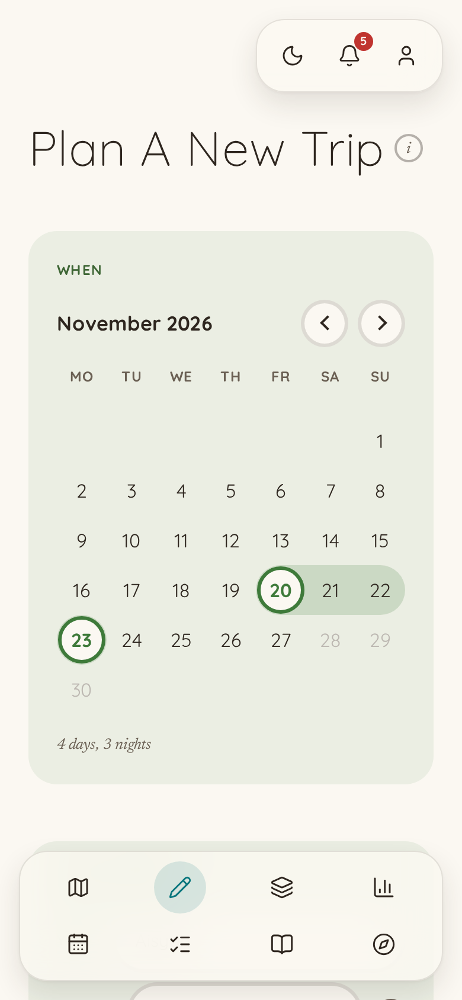
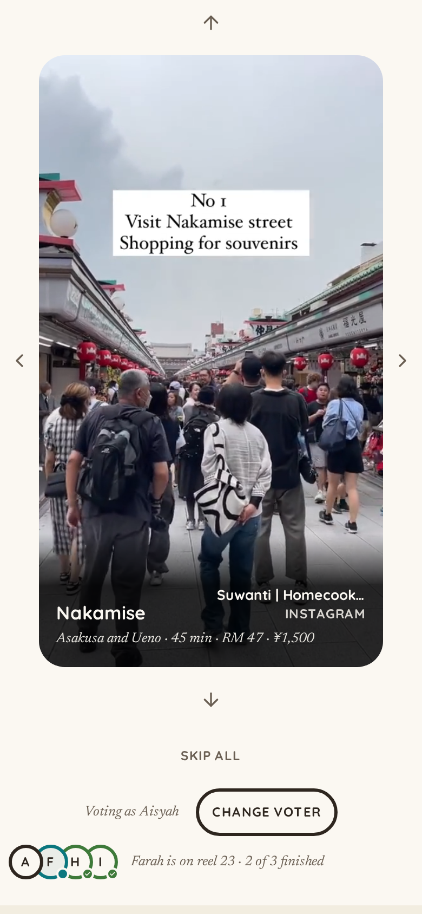
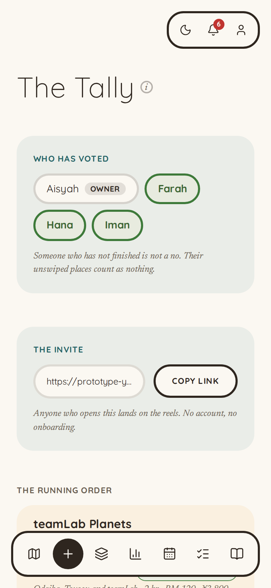
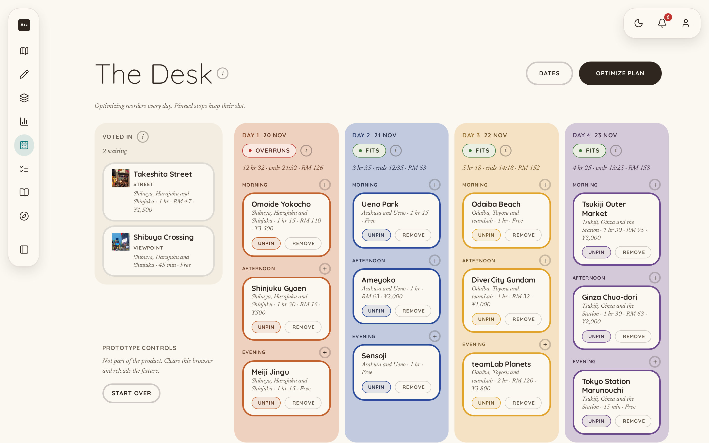
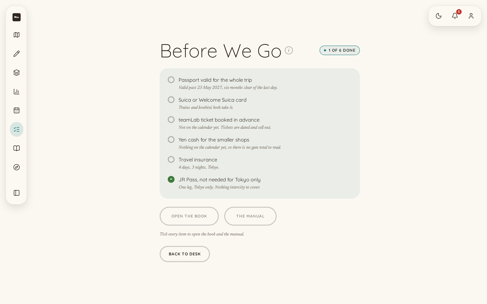

# Perch, By TolongLabs

|                         |                                                                                         |
| ----------------------- | --------------------------------------------------------------------------------------- |
| **Team**                | TolongLabs, four members. **Names to be filled by the team leader before submission**   |
| **Problem Statement**   | Travel Planner, Track 1: Lifestyle & Personal Productivity                              |
| **Live Prototype**      | **https://prototype-yskhynz4la-as.a.run.app** - opens in incognito, no account          |
| **Video Presentation**  | Not recorded yet. Tracked in [issue #10](https://github.com/TolongLabs/Perch/issues/10) |
| **Presentation Slides** | [`demo/slides.pdf`](demo/slides.pdf), 18 pages, one per rubric band and then some       |

> **Every tool a group already uses can produce a plan. None of them turns the group's decision into days. Perch does,
> and prints them.**

---

## 1. Project Overview

### The Problem

**The brief names it, and we quote it rather than paraphrase it:** _"when something changes mid-trip, there's rarely any
real help from existing platforms in adjusting."_

**The symptom is that planning a trip is a hassle. The causes are four, and only the fourth is unserved.** We are not
competing with Wanderlog; we are competing with the stack of free apps a group already has, WhatsApp, Google Maps and a
money tool, which is why the first three rows are not ours.

| Cause                                                       | Who Serves It Today                                             | Ours?             |
| ----------------------------------------------------------- | --------------------------------------------------------------- | ----------------- |
| Producing a plausible itinerary is slow                     | **Solved.** Chatbots commoditised it                            | No                |
| The plan lives in five places at once                       | **Partly solved.** Wanderlog puts itinerary and map in one view | No                |
| Getting a group to decide                                   | **Partly solved.** WhatsApp polls and swipe apps produce a vote | Only as the input |
| **Turning that decision into scheduled, costed, kept days** | **Nobody.** The vote stays a vote and the plan is a screenshot  | **Yes**           |

**The stakeholders are not who the category sells to.** One person in every group does the planning, and the cost is not
that the plan is hard to make; it is who turns thirty opinions in a chat into four days that hold.

| Stakeholder                     | What They Carry Today                                                              |
| ------------------------------- | ---------------------------------------------------------------------------------- |
| **The organiser**               | Reading the whole chat, deciding for everyone, and the social cost of chasing them |
| **The other three**             | Nothing, which is the problem. No stake means no reply                             |
| **The person who fronts money** | The deposit, then a month of asking                                                |

### Similar Apps, And Where They Fall Short

**We are not competing with a travel planner. We are competing with a stack of free apps she already has.** Four
competitor passes are in [`research/market/`](research/market/); the two most relevant products were read directly
rather than from a summary.

| Product                                      | What It Does Well                                                         | Where It Falls Short                                                                                                                                                     |
| -------------------------------------------- | ------------------------------------------------------------------------- | ------------------------------------------------------------------------------------------------------------------------------------------------------------------------ |
| **[Wanderlog](https://wanderlog.com)**       | "Your itinerary and your map in one view" - its own tagline               | The plan is a document it stores. Nothing watches it, so a closed stop is still the group's problem                                                                      |
| **[Roadtrippers](https://roadtrippers.com)** | Suggestion quality, from "over 42 million trips"                          | Route-shaped and single-traveller. No group preference, no repair                                                                                                        |
| **[SwipeSights](https://swipesights.com)**   | **Computes a ranked group preference order**, super-likes weighted double | **It spends that ranking on how long you stay.** The losing swipes are discarded. Its own FAQ tells the group to _"double-check opening hours closer to your trip date"_ |
| **Google Maps**                              | Holds the pins, and everyone already has it                               | Holds places, not decisions. Its own reviewers call collaborative editing glitchy and not real-time                                                                      |
| **WhatsApp**                                 | Free, open, and where the trip already lives. **The real incumbent**      | A poll produces a result, not a plan. Nobody turns thirty votes into a routed itinerary                                                                                  |

> Every tool a group already uses can produce a plan. **None of them owns the plan afterwards.**

**A direct competitor had the ranking in its hands and spent it on a different problem.** That is a better originality
argument than "nobody does this", and unlike that claim it is checkable.

### Our Solution

**The group swipes on reels of places, the owner drags what won onto a three-slot-a-day calendar, a heuristic orders
each day and colours it by how well the route holds, and the finished trip prints as The Book.** The decision the group
makes in swipes survives intact to a printed keepsake, and the only hands it passes through are the organiser's,
dragging. One chain, and the feature list below is that chain in order.

| Feature          | What It Does                                                                                                              |
| ---------------- | ------------------------------------------------------------------------------------------------------------------------- |
| **Onboarding**   | Free text first, chips as shortcuts under it, and a drawn month tapped twice for the dates                                |
| **The Deck**     | The invite link. Each place is a reel; friends swipe yes or no with no account and no install                             |
| **The Tally**    | A percentage per place. The owner's swipe weighs 1.5; unanimous places go gold, places nobody wanted are greyed           |
| **The Desk**     | Four days by three slots. She drags what won into slots, pins what must not move, and Apply orders every day around it    |
| **Feasibility**  | Each day is green, gold or red with a stated reason: it holds, it holds but the order is slow, or a stop is outside hours |
| **The Perch**    | Remove a card and the drawer offers the next-ranked voted-in place for that slot, so the trip cannot empty                |
| **Before We Go** | A checklist derived from the trip itself, and all of it ticked is what unlocks the print                                  |
| **The Book**     | The shared link and the keepsake. One plate per day drawing that day's real route, with a transit deep link under each    |

**The scheduler is a heuristic and the copy never calls it AI**: cluster by area per day, order by best period and
opening hours, nearest neighbour within the day. Its colours are the explanation, and every red carries the reason.

---

## 2. Ideation & Process

**The ideation notebook is [`research/`](research/), kept whole.** It is plain-language, dated, and was written as the
thinking happened rather than reconstructed afterwards. Everything in this section is quoted from files in it, and each
file is linked so a reviewer can read the original rather than our summary of it.

### 2.1 Ideas We Considered

**Chosen first, then the directions we dropped.** Reasons are the notebook's own words, not a tidier version written
afterwards.

| Idea                                                                          | Kept Or Dropped | Why                                                                                                                                                                                                                                                                                                   |
| ----------------------------------------------------------------------------- | --------------- | ----------------------------------------------------------------------------------------------------------------------------------------------------------------------------------------------------------------------------------------------------------------------------------------------------- |
| **Swipe on reels, drag what won, a heuristic orders the day** (chosen 8 Sept) | **Kept**        | The rebuild after mentor session 1, in [`research/decisions/rebuild-verdict-2026-09-08.md`](research/decisions/rebuild-verdict-2026-09-08.md): _"Actively thinking is harder than just deciding yes or no."_ The group's decision, made in swipes, reaches a printed book untouched                   |
| **The trip as a storybook, read-only when finished**                          | **Kept**        | A keepsake has to be a finished thing. The Book is printed state only, one plate per day, and it is what the group keeps                                                                                                                                                                              |
| **The self-repairing itinerary** (chosen 4 Sept, dropped 8 Sept)              | **Dropped**     | It needed a disruption fired by hand and a bench nobody had voted for, and _"the video now has to carry what the interaction used to show"_. After the mentor session the claim moved from repairing a plan to turning the group's decision into days; the ranked losers survived as the Perch drawer |
| **The interview instead of a form**                                           | **Dropped**     | _"I have to click a lot and I have to know what I want."_ Replaced on 8 Sept by onboarding with free text first and the swipe deck, which asks nothing the friend has to compose                                                                                                                      |
| **Map-first planner with a round-trip decision** (the original idea)          | **Superseded**  | "Stopped claiming the planner as novel; narrowed the claim to the round trip" - then Contour and calimoto were found shipping loops                                                                                                                                                                   |
| **Split planning: members claim days to fill**                                | **Dropped**     | "Splitting the work between four people does not remove the work, it distributes it." Killed by a teammate's question, and it was already built and working                                                                                                                                           |
| **One book in two states, voting inside the flipbook**                        | **Dropped**     | "A flipbook is built for reading, and hosting vote widgets and swap menus inside one fights the format." **It demoed better and still lost**                                                                                                                                                          |
| **Group voting as the originality claim**                                     | **Dropped**     | "Tripeza, SwipeSights and Plan Harmony all ship vote-then-generate for groups"                                                                                                                                                                                                                        |
| **Photo spots as a feature**                                                  | **Dropped**     | "It is a whole product category - Locationscout has 233,000 spots"                                                                                                                                                                                                                                    |
| **All-in-one platform as the differentiation argument**                       | **Dropped**     | "The incumbents own breadth, and five thin pages cost more under Feasibility than they gain under Creativity"                                                                                                                                                                                         |
| **A chat panel for planning**                                                 | **Dropped**     | "Conversational planning is where ChatGPT and TripGenie win." It also invites the one comparison we lose                                                                                                                                                                                              |
| **Bill splitting**                                                            | **Dropped**     | Every panel answer said the arithmetic is fine and **the collection is the problem**. Solving the half that already works                                                                                                                                                                             |
| **A mascot copilot**                                                          | **Dropped**     | It makes the plan feel authored, when its whole value is that it is derived                                                                                                                                                                                                                           |

**Two of those were dropped after being built and working**, and both write-ups say what it cost us to drop them.
[`research/decisions/dropped.md`](research/decisions/dropped.md) carries them in full, including the cost paragraph for
each.

### 2.2 Ideation Boards


**Six days of ideation drawn as a tree**: what we claimed, what got built, the three competitor scans, the four branches
we dropped, and the marks still unclaimed. The dropped branches are on the page deliberately rather than only in the
decisions log.


**What a group actually does, stage 0 to stage 8**, and the loop back from "it broke" to "the plan re-derives". The
mindmap shows how the thinking moved; this shows the product it produced.

**Both are exports.** The Obsidian Canvas sources live in [`research/diagrams/`](research/diagrams/), alongside the
Python that renders them, so either can be regenerated rather than redrawn.

**The written trail underneath them is the substance**, and it is longer than two pictures.

| Record                                                                       | What Is In It                                                                             |
| ---------------------------------------------------------------------------- | ----------------------------------------------------------------------------------------- |
| [`research/decisions/iteration-log.md`](research/decisions/iteration-log.md) | **Over fifty dated turns**, each with what changed, why, and what triggered it            |
| [`research/decisions/dropped.md`](research/decisions/dropped.md)             | Full write-ups of directions abandoned, including what dropping each one cost             |
| [`research/market/`](research/market/)                                       | Four competitor passes, with every source graded by whether the page was actually read    |
| [`research/users/`](research/users/)                                         | The persona, every claim marked `[assumed]`, and a synthetic panel marked as not evidence |
| [`research/inbox/`](research/inbox/)                                         | The raw dumps the ideas came out of, unedited                                             |

### 2.3 Mentor Consultation

| Date        | Mentor                                                                            | Feedback Received                                                                                                                                                                                                                                                  | What Was Changed                                                                                                                                                                                 |
| ----------- | --------------------------------------------------------------------------------- | ------------------------------------------------------------------------------------------------------------------------------------------------------------------------------------------------------------------------------------------------------------------ | ------------------------------------------------------------------------------------------------------------------------------------------------------------------------------------------------ |
| 7 Sept 2026 | **Zach Khong**, Full Stack Engineer at Solana Foundation, Cursor hackathon winner | _"All these features right, like one to six, is stuff that people will already build."_ Nine of his twelve teams are building a travel planner. Voting is table stakes; _"the way that how you represent the voting feature is what would make your app special."_ | Voting rebuilt as a swipe deck of reels, one place per card, the name set small under the picture so the decision is made on the image. The flow reframed as **vibe based planning**, his phrase |
|             |                                                                                   | _"I have to click a lot and I have to know what I want."_ _"The results could be nice UI, but the data collection could be just unstructured text."_                                                                                                               | The onboarding collapsed to one screen where free text comes first and choice chips are shortcuts under it. The eat-shop-do page and its separate vote step were dropped                         |
|             |                                                                                   | _"I feel like the voting part is a bit stiff"_ - a 50-50 split had no answer. _"Actively thinking is harder than just deciding yes or no."_                                                                                                                        | The 50-50 case is settled by the plan owner's swipe carrying tie-break weight, and the pre-trip plan proposes so the group only accepts or rejects                                               |
|             |                                                                                   | _"Being specific can definitely be your strength... you could plan to that level of cultural detail."_                                                                                                                                                             | The demo trip is Japan for Aisyah, with transit times between areas modelled rather than a generic international planner                                                                         |
|             |                                                                                   | _"Voting doesn't have to be yes or no. You could be like, oh, I like this place like maybe 65 percent."_                                                                                                                                                           | **Not changed yet.** Binary swipe ships in the mockup; a strength-of-swipe spectrum is logged as the first candidate for the build phase                                                         |

**The full session is transcribed verbatim** at
[`source/mentor-session-1-transcript.md`](source/mentor-session-1-transcript.md): 38 minutes, Whisper-transcribed with
timestamps preserved, with a table of the quotes most likely to be cited. It was booked through
[issue #23](https://github.com/TolongLabs/Perch/issues/23).

**What the session did not endorse is recorded too.** He proposed a group chat with an AI reading it, and drawing on a
map; both are in the transcript and neither was adopted, because a chat panel invites the "why not ChatGPT" comparison
and a canvas does not survive a five-minute demo. The Fruit Ninja slice vote was our idea, and he was _"not sure about a
slashing thing"_; it was dropped on the call.

---

## 3. Design & Prototype

| Link                                                                   | What Is In It                                      | Access                         |
| ---------------------------------------------------------------------- | -------------------------------------------------- | ------------------------------ |
| **[The running prototype](https://prototype-yskhynz4la-as.a.run.app)** | The built app. Redeployed on every merge to `main` | **Public, opens in incognito** |

**The two Figma files** — the greyscale wireframe and the visual mockups — are listed with their contents and access
notes in [`DESIGN.md`](DESIGN.md#the-figma-files), which is where the design spec they realise also lives.

**Greys are deliberate.** The wireframe was drawn before [`DESIGN.md`](DESIGN.md) existed so that structure could be
judged without visual direction leaking into it, and so a structural problem and a styling problem never get argued
about at the same time.

### Eight Screens From The Running Build

| Screen                                               | What Happens Here                                                                                                                                                                                                                                                                              |
| ---------------------------------------------------- | ---------------------------------------------------------------------------------------------------------------------------------------------------------------------------------------------------------------------------------------------------------------------------------------------- |
|  | The one screen before you commit to anything. It states the mechanism rather than the benefit, and offers two ways in: start a plan, or open a book someone has already shared with you                                                                                                        |
|     | Aisyah sees the trip, who has already swiped, and the link to send the ones who have not. The button reads Open The Deck while she has reels left and See The Tally once she is finished, so the card always names the next thing to do                                                        |
|       | She sets the dates by tapping a drawn month twice, then says what she wants out of the trip in her own words before she taps any of the suggestions. Only Tokyo can be picked, and the screen says why instead of letting her find out later                                                   |
|               | The invite link opens here, on a phone, with no account and no sign-up. She swipes each reel left or right and the count goes down. Her three friends swiped when she sent the link, so the tally is never waiting on everyone at once                                                         |
|             | Every place carries a percentage of the group's weighted vote, where the owner's swipe counts one and a half. Places everyone said yes to take the gold mark; places nobody wanted are greyed and drop out of the running order entirely                                                       |
|               | She drags a card into a slot and Apply orders each day around whatever she has fixed. Day 1 has just turned gold: it still fits, but she moved a stop across the city and the day now runs 32 minutes slower than the order the scheduler would have chosen                                    |
|   | Six things read off the trip rather than written beside it. The passport date is six months past her last day, the teamLab row names the day that place actually falls on, and the yen figure is the gate total of what is on the calendar. Print The Book stays shut until all six are ticked |
|               | What the group keeps. One plate per day, each drawing that day's real route through its stops, with the dwell, the ringgit and the yen under every entry, and a link that opens the whole day as transit directions in Google Maps                                                             |

**The flow is Landing, Dashboard, Onboarding, The Deck, The Tally, The Desk, Before We Go, The Book**, and every step is
a real click in the deployed prototype. Nothing here is a static mock-up of a screen that does not exist.

**The six phone screens are captured at 390 by 844 and the two desktop screens at 1440 by 900, every one rendered at
double scale so it stays sharp on a high-density display**, which is why their proportions differ. The Desk is the one
surface built for a wider screen, because four day columns and a sidebar cannot be read at phone width; the story the
product tells has the group swiping on their phones from a link and the owner shaping the days at a desk.

**The Prototype Controls block on The Desk is deliberate and is labelled as not part of the product.** The trip lives in
one browser with no account behind it, so there is no other way to put the fixture back between runs, and a demo that
can only be reset by opening developer tools is a demo that cannot be handed to anyone.

**The design direction is a field guide, not a travel brochure**, and [`DESIGN.md`](DESIGN.md) records where every part
of it came from - including the two live registers that were looked at and rejected, and the measurements taken off a
real bird guide and off four Japanese sites read directly. The eight studies behind it are in [`design/`](design/).

---

## 4. What Makes It Different

**One novel chain, and we are deliberately not claiming more than one.**

| What                                                      | Why It Is Novel, Or What The Twist Is                                                                                                                                                   |
| --------------------------------------------------------- | --------------------------------------------------------------------------------------------------------------------------------------------------------------------------------------- |
| **The swipes become the calendar**                        | SwipeSights computes a ranked group preference and spends it on how long you stay. **We spend it on the days**: the tally is the only input to the scheduler, and nothing else is asked |
| **The losing swipes are kept and spent**                  | Every voting product discards what lost. The ranked voted-in list survives as the Perch drawer, so removing a card offers the next place the group already said yes to                  |
| **Owner priority without owner override**                 | The owner's swipe weighs 1.5 and she can pin any card the scheduler must not move. **She can carry a place in against indifference, not against three friends who said no**             |
| **The day explains itself in colour**                     | Green, gold or red per day with the reason stated: the order is slow by so many minutes, or this stop is shut on Monday. **A heuristic that says what it did, never called AI**         |
| **The invite link is the deck, the keepsake is the book** | Friends land on reels and swipe with nothing installed; what they get back is a printed book of the trip they chose. **The book is not a reward at the end, it is why they swipe**      |

### Against The Products We Named

|                                          | Wanderlog | Roadtrippers | SwipeSights | Google Maps + WhatsApp | **Perch** |
| ---------------------------------------- | :-------: | :----------: | :---------: | :--------------------: | :-------: |
| Builds an itinerary                      |    Yes    |     Yes      |     Yes     |           No           |    Yes    |
| Combines group preferences               |    No     |      No      |   **Yes**   |       Poll only        |    Yes    |
| **Keeps the losing preferences**         |    No     |      No      |   **No**    |           No           |  **Yes**  |
| **Schedules the votes into routed days** |    No     |      No      |     No      |           No           |  **Yes**  |
| **Says in colour whether a day holds**   |    No     |      No      |     No      |           No           |  **Yes**  |
| Works with no account and no install     |    No     |      No      |     No      |        **Yes**         |  **Yes**  |

**What we do not claim** is as important, and [`PRODUCT.md`](PRODUCT.md#what-we-claim-and-what-we-do-not) lists six
non-claims with the reason for each: not better suggestions, not that generating an itinerary is hard, not a new layout,
not clever routing, not novel group voting, and not photo spots.

**The honest risk:** Troupe ships ranked group voting and **we have not read it**. If it already turns its votes into a
scheduled calendar, the originality claim is gone. It is named as the biggest hole in [`PRD.md`](PRD.md#market-fit)
rather than assumed away.

---

## 5. Technical Architecture & Feasibility

### Tech Stack

| Layer         | Choice                                           | Why, And What It Costs                            |
| ------------- | ------------------------------------------------ | ------------------------------------------------- |
| **Frontend**  | Vite 8, React 19, react-router-dom 7             | No SSR need, so no framework tax                  |
| **Language**  | TypeScript 7 strict, `noUncheckedIndexedAccess`  | Catches the bug class a committed fixture hides   |
| **Tooling**   | Bun                                              | Package manager and script runner                 |
| **Styling**   | Plain CSS custom properties, no framework        | One tokens file, one CSS file per surface         |
| **Fonts**     | Quicksand and Newsreader, self-hosted woff2      | No CDN call the demo can fail on                  |
| **State**     | One React context mirrored to `localStorage`     | Validated at the boundary, not cast               |
| **Data**      | Committed TypeScript fixtures                    | Versioned with the code, reviewable in a PR       |
| **Drag**      | `@dnd-kit/core`, the one new dependency          | Accessible drag for the calendar slots            |
| **Backend**   | **None, by design, for the prototype**           | Nothing in the Must tier writes to a server       |
| **APIs**      | **None. No key exists**                          | The demo cannot fail on someone else's rate limit |
| **Reels**     | Small muted MP4s from a public GCS bucket        | The one network call on stage                     |
| **Hosting**   | Google Cloud Run, `asia-southeast1`              | Scales to zero, so free at our traffic            |
| **CI/CD**     | GitHub Actions on every merge to `main`          | Workload Identity Federation, no stored key       |
| **Container** | Two-stage `Dockerfile`: Bun builds, nginx serves | The build happens inside the image                |

**Why not Vercel**, since it is the obvious choice: its Hobby tier only builds commits authored by the account owner, so
a teammate's merge would not ship. Cloud Run has no such rule, and no one person holds the keys.

**The constraints on stage.** The prototype has no backend, no auth, no API key and no network call other than reel MP4s
from a public GCS bucket. The demo is one city, Tokyo; the data model carries legs, so multi-area Japan is a README
claim backed by a type rather than a screen. Place data is hand-authored for now: 24 places across four clusters and a
24 x 24 travel matrix, both committed.

**One piece of prior work is in the repo, and it ships nothing to a user.** `scripts/demo/` is the recorder that films
the deployed site, dubs it and burns in subtitles for the submission video. It was written for `TolongLabs/MakanLah` on
28-30 August 2026, ported into `MUBA-M1KU/Cekgu` on 5 September 2026 by the same author, Hee Zi Jie, hardened there, and
carried in here on 8 September 2026. Its README declares the same. Nothing else predates 30 August.

**Onboarding's free text and activity chips are captured on the screen and inform nothing downstream.** Turning them
into tag weights is specified in [`TRD.md`](TRD.md) under Specified, Not Yet Built, and is build-phase work.

### Build Phase Additions

The build phase adds, and only adds, the following to a stack that already works:

- **Supabase** for auth, votes and realtime
- **Place seeding** from OpenStreetMap, Wikidata and Wikimedia Commons, not Google Places, whose terms cap caching at 30
  days and forbid storing photos
- **Google only** for Maps deep links and a Routes call
- **An LLM only** for parsing free text intent and writing rationale sentences, never for a scheduling decision
- **Cloud Run hosting** stays as is

### Build Plan & Scope

**Three weeks, 21 September to 11 October.** The build phase takes the prototype from fixture to product: Supabase
replaces the fixture for auth and votes, seeded place data replaces the hand-authored set behind the same shape, and the
Routes call plus the LLM rationale land last.

**What it will not build:** multi-area Japan beyond the legs type, native apps, and any surface outside the route table
in [`PRD.md`](PRD.md). The Interview and the old Desk were deleted on 8 September, not kept behind a flag.

**Deployment phase, 12 to 31 October, is bug fixes only.** Landing a major feature in it is grounds for
disqualification, so scope freezes at the end of week three and does not reopen.

---

## The Research Notebook

**Ideation lived on a separate branch until 8 September, and now lives in [`research/`](research/).** It was moved onto
`main` whole so that every file section 2 quotes is one click from this page, and so the repo that gets submitted holds
the trail rather than pointing at a branch a reviewer would have to fetch. Nothing in it was edited in the move.
[`PRODUCT.md`](PRODUCT.md), [`PRD.md`](PRD.md) and [`TRD.md`](TRD.md) are written from what it established and cite it.

---

## For The Team

### Start Here

| File                           | What's In It                                                                         |
| ------------------------------ | ------------------------------------------------------------------------------------ |
| [`brief.md`](brief.md)         | The whole competition: phases, rules, deliverables, judging, mentors, judges         |
| [`PRODUCT.md`](PRODUCT.md)     | **The spine.** Who Perch is for, the one sentence, the demo moment, the scope ladder |
| [`PRD.md`](PRD.md)             | Problem, objectives, users, market fit, then requirements and acceptance criteria    |
| [`TRD.md`](TRD.md)             | **Canonical on anything under `src/`.** Architecture, data model, the scheduler      |
| [`DESIGN.md`](DESIGN.md)       | The design system: the field-guide direction, palette, type, radius, motion          |
| [`../AGENTS.md`](../AGENTS.md) | Project instructions for agentic tools, and humans                                   |

Work in progress lives in the [Issues board](https://github.com/TolongLabs/Perch/issues), not in a checklist here.

### Source Material From The Organisers

Verbatim, append-only. We cite these instead of relying on memory.

| File                                                                         | Source                                                          |
| ---------------------------------------------------------------------------- | --------------------------------------------------------------- |
| [`source/kickoff-day-transcript.md`](source/kickoff-day-transcript.md)       | Kick-Off Day recording, 30 Aug. Whisper transcript              |
| [`source/kickoff-day-slides.md`](source/kickoff-day-slides.md)               | Kick-Off Day deck, 30 slides. Authoritative on dates and rubric |
| [`source/problem-statements.md`](source/problem-statements.md)               | The two problem statements and the general stipulations         |
| [`source/prototype-judging-rubrics.md`](source/prototype-judging-rubrics.md) | The prototype rubric, band by band                              |
| [`source/submission-template.md`](source/submission-template.md)             | The organisers' README template and video outline               |

### Getting Started

```bash
bun install                  # dependencies and the husky git hooks
cp .env.example .env         # empty of keys today; the prototype calls nothing external
bun run dev                  # the prototype, on http://localhost:5173
```

| Command             | Does                                        |
| ------------------- | ------------------------------------------- |
| `bun run dev`       | Vite dev server                             |
| `bun run build`     | Production build into `dist/`               |
| `bun run preview`   | Serve that build on 8080, as Cloud Run does |
| `bun run lint`      | Biome check, then Prettier check            |
| `bun run format`    | Both formatters, writing in place           |
| `bun run typecheck` | `tsc --noEmit`                              |
| `gh issue list`     | The TODO board                              |

Biome covers JS, TS, JSON, CSS and HTML; Prettier covers the Markdown and YAML it cannot, wrapping prose at 120 to match
`biome.json`'s `lineWidth`. There is no `.prettierignore`, so every Markdown file is formatted.

### How Work Ships

**`main` is PR-gated.** Branch as `<type>/<slug>`, open a PR with `gh pr create`, merge with
`gh pr merge --squash --delete-branch`. Anyone may merge, agents included - **the PR is there to make a change
reviewable and revertable, not to make it wait.** The notebook under `research/` follows the same rule now that it is on
`main`.

**The gate is enforced client-side, for now.** GitHub only offers branch protection on a private repo under a paid plan,
so today the rule is held up by `.claude/hooks/guard-git.sh`, which blocks a direct or force push to `main`. **That
stops an agent, not a determined human.** Protection becomes free the moment the repo goes public, which it must before
submission anyway - tracked in [issue #13](https://github.com/TolongLabs/Perch/issues/13).

### Layout

```
docs/
  README.md              this file. The submission surface, and the GitHub landing page
  brief.md               competition facts, the single source of truth
  PRODUCT.md             who, why, the demo moment
  PRD.md                 problem, objectives, users, market fit, requirements
  TRD.md                 how: architecture, contracts, schemas. Canonical
  DESIGN.md              the design system
  design/                the eight studies DESIGN.md is drawn from
  assets/screens/        the screens in section 3, captured from the running build
  assets/ideation/       the two diagram exports in section 2.2, copied from research/diagrams/exports/
  research/              the ideation notebook: decisions, market scans, personas, diagrams, dropped ideas
  source/                organiser material, append-only
  demo/                  video script, slides, assets
v1/                      the slide-deck mockup this replaced. Static HTML, served at /v1/
v2/
  index.html             the Vite entry
  public/                static assets copied verbatim: the mark and the self-hosted fonts
  src/
    data/                types, the place fixture, the seeded trip
    lib/                 the tally, the scheduler and feasibility, persistence, cost, formatting, with tests
    surfaces/            one file per route: Landing, Sign In, Dashboard, Onboarding, Deck, Tally, Desk, Before We Go, Book
    components/          the reel card, the placed card, the Perch drawer, the state chip, the plate, shared UI
    styles/              tokens.css and base.css, the DESIGN.md system in CSS
scripts/demo/            the demo recorder. Prior work, declared above and in its own README; not in package.json
vite.config.ts           roots the build at v2/ and writes dist/
Dockerfile               two stages. Bun builds v2, nginx serves dist/ and v1/ on 8080
nginx.conf               static config: /v1/ resolves first, then the SPA fallback
.github/workflows/       deploy.yml, which builds and ships on every merge
```

### Deployment

**Every merge to `main` redeploys**, whoever pushed. No manual step, and no one person holding the keys.

|             |                                                                                            |
| ----------- | ------------------------------------------------------------------------------------------ |
| **Live**    | [prototype-yskhynz4la-as.a.run.app](https://prototype-yskhynz4la-as.a.run.app)             |
| **Trigger** | Any push to `main`. **No path filter on purpose** - a filter means a change lands silently |
| **Auth**    | Workload Identity Federation. **No service-account key exists**, in the repo or in Secrets |
| **Project** | `codenection-2026`, region `asia-southeast1`                                               |

**The prototype is built, not copied.** The first stage of `Dockerfile` runs `bun run build` and nginx serves the
resulting `dist/`. **`v2/public/` is Vite's static asset folder**, holding the mark and the fonts; everything else comes
from `v2/src/`.

**v1 ships in the same image, at [`/v1/`](https://prototype-yskhynz4la-as.a.run.app/v1/).** It is static HTML rather
than routes, so `nginx.conf` resolves it before the SPA fallback - without that ordering every path under it would
render v2 instead.

**The shared link needs the SPA fallback.** `/t/<trip>` is a real path with no file behind it, so `nginx.conf` falls
every unknown path back to `index.html`. Delete that line and the link at the centre of the product returns a 404.

---

**This README is the submission.** Asked at Kick-Off Day what the format is, the organisers answered that the Google
Form takes a public repo URL and _"everything must live in the README of your repo - project overview, a link to your
visual presentation, your ideation and process assets, and your design and prototype artifacts."_

It lives in `docs/` rather than the repo root and still renders as the landing page: **GitHub surfaces a README from the
root, `.github/` or `docs/`.** There is exactly one README and this is it, so keep its links relative to `docs/`. Its
five numbered sections follow the organisers' own template, transcribed at
[`source/submission-template.md`](source/submission-template.md).
