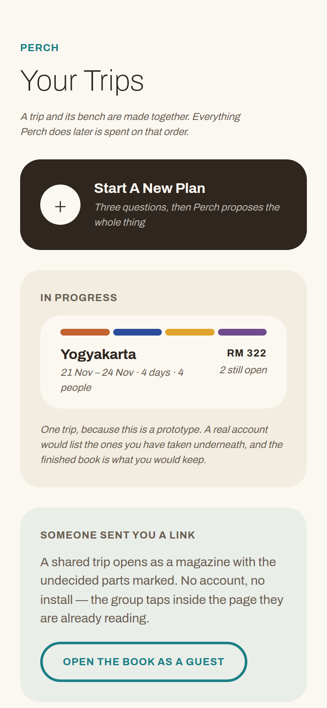
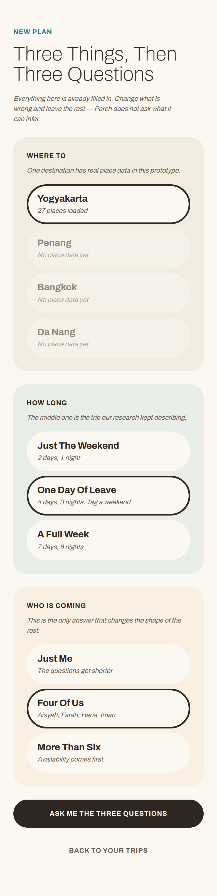
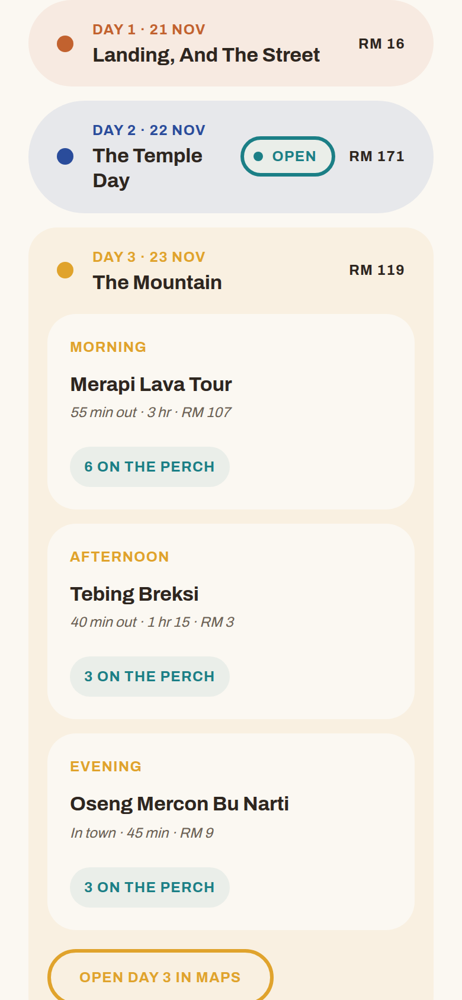
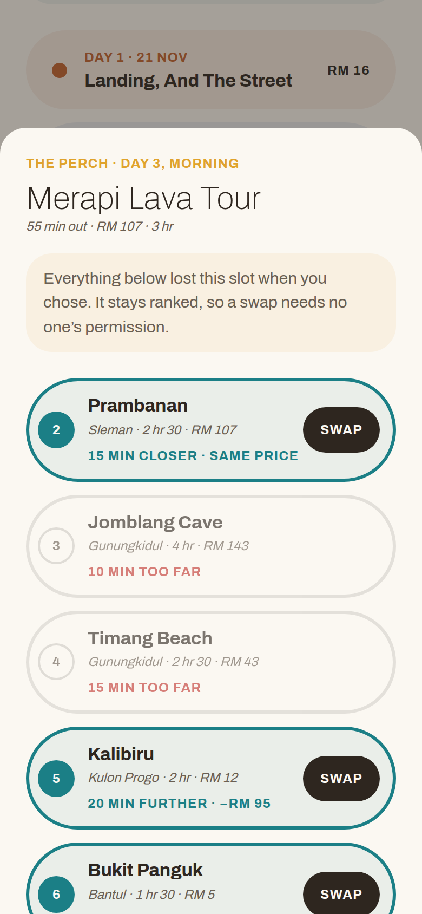
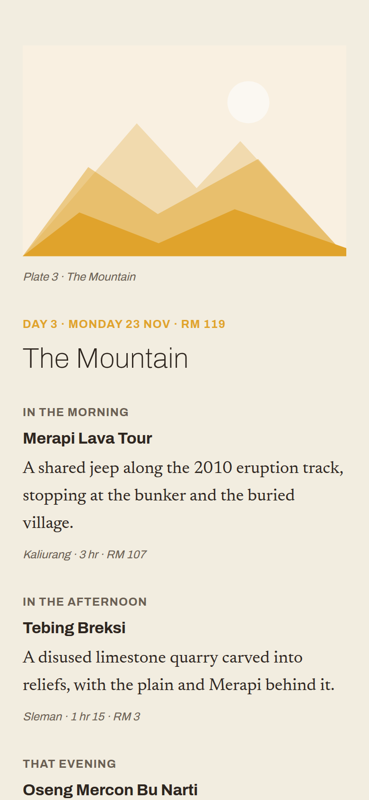
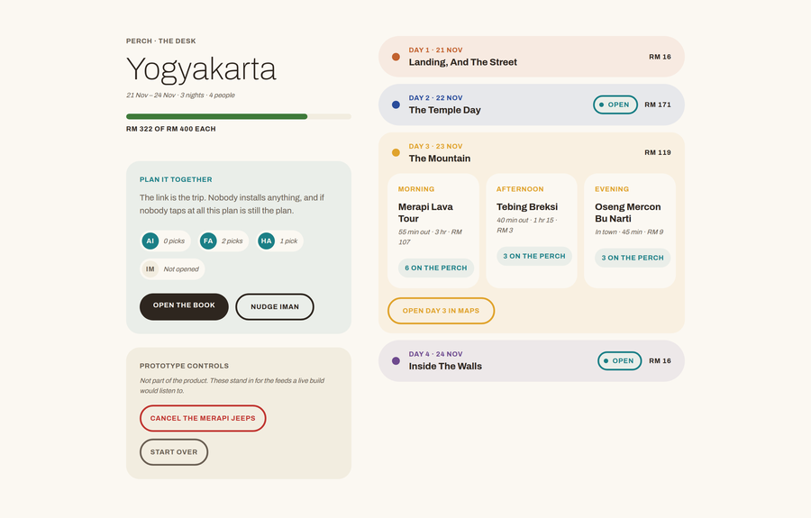

# Perch, By TolongLabs

|                         |                                                                                                   |
| ----------------------- | ------------------------------------------------------------------------------------------------- |
| **Team**                | TolongLabs, four members. **Names to be filled by the team leader before submission**             |
| **Problem Statement**   | Travel Planner, Track 1: Lifestyle & Personal Productivity                                        |
| **Live Prototype**      | **https://prototype-yskhynz4la-as.a.run.app** - opens in incognito, no account                    |
| **Video Presentation**  | Not recorded yet. Tracked in [issue #10](https://github.com/TolongLabs/codenection-dev/issues/10) |
| **Presentation Slides** | Not built yet. Tracked in [issue #11](https://github.com/TolongLabs/codenection-dev/issues/11)    |

> **The itinerary knows what can break it, and repairs itself from options the group already approved.**

---

## 1. Project Overview

### The Problem

**The brief names it, and we quote it rather than paraphrase it:** _"when something changes mid-trip, there's rarely any
real help from existing platforms in adjusting."_

**The symptom is that planning a trip is a hassle. The causes are four, and only the fourth is unserved.**

| Cause                                         | Who Serves It Today                                             | Ours?                |
| --------------------------------------------- | --------------------------------------------------------------- | -------------------- |
| Producing a plausible itinerary is slow       | **Solved.** Chatbots commoditised it                            | No                   |
| The plan lives in five places at once         | **Partly solved.** Wanderlog puts itinerary and map in one view | No                   |
| Getting five calendars and budgets to line up | **Partly solved.** Polls and swipe apps produce a result        | Only as a by-product |
| **Nothing owns the plan once it is made**     | **Nobody**                                                      | **Yes**              |

**The stakeholders are not who the category sells to.** One person in every group does the planning, and the cost of a
disruption is not that the trip degrades - it is who pays for the repair.

| Stakeholder                     | What They Carry Today                                                     |
| ------------------------------- | ------------------------------------------------------------------------- |
| **The organiser**               | Every re-check, every re-plan, and the social cost of chasing four people |
| **The other four**              | Nothing, which is the problem. No stake means no reply                    |
| **The person who fronts money** | The deposit, then a month of asking                                       |

### Similar Apps, And Where They Fall Short

**We are not competing with a travel planner. We are competing with a stack of free apps she already has.** Four
competitor passes ran on the [`research` branch](#the-research-branch); the two most relevant products were read
directly rather than from a summary.

| Product                                      | What It Does Well                                                         | Where It Falls Short                                                                                                                                                     |
| -------------------------------------------- | ------------------------------------------------------------------------- | ------------------------------------------------------------------------------------------------------------------------------------------------------------------------ |
| **[Wanderlog](https://wanderlog.com)**       | "Your itinerary and your map in one view" - its own tagline               | The plan is a document it stores. Nothing watches it, so a closed stop is still the group's problem                                                                      |
| **[Roadtrippers](https://roadtrippers.com)** | Suggestion quality, from "over 42 million trips"                          | Route-shaped and single-traveller. No group preference, no repair                                                                                                        |
| **[SwipeSights](https://swipesights.com)**   | **Computes a ranked group preference order**, super-likes weighted double | **It spends that ranking on how long you stay.** The losing swipes are discarded. Its own FAQ tells the group to _"double-check opening hours closer to your trip date"_ |
| **Google Maps**                              | Holds the pins, and everyone already has it                               | Holds places, not decisions. Its own reviewers call collaborative editing glitchy and not real-time                                                                      |
| **WhatsApp**                                 | Free, open, and where the trip already lives. **The real incumbent**      | A poll produces a result, not a plan. Nobody turns thirty votes into a routed itinerary                                                                                  |

> Every tool a group already uses can produce a plan. **None of them owns the plan afterwards.**

**A direct competitor had the ranking in its hands and spent it on a different problem.** That is a better originality
argument than "nobody does this", and unlike that claim it is checkable.

### Our Solution

**Perch turns one act of choosing into two things at once: the trip, and a ranked bench of everything that lost.** When
a stop closes, the bench is the replacement pool, so nobody has to be consulted. When the trip goes over budget, the
same bench is the cut list. When someone changes their mind, it is the same interaction again. **One mechanism, four
jobs** - which is why the feature list below is short on purpose.

| Feature            | What It Does                                                                                                            |
| ------------------ | ----------------------------------------------------------------------------------------------------------------------- |
| **The Interview**  | Three questions. The third deals ten places and keeps three - **and ranks the other seven rather than discarding them** |
| **Perch Proposes** | A complete trip renders with no further input. The group's taps only reorder what it already chose                      |
| **The Desk**       | Her private workspace. Days, slots, states, and what every day costs                                                    |
| **The Book**       | The shared link, and it is a magazine. Undecided slots render as marked blanks the group taps                           |
| **The Perch**      | The bench, opened on any slot. **Rows that cannot take the slot stay visible and say why**                              |
| **What Changed**   | One sentence naming the swap, its cause, its rank, and its cost in travel and money                                     |

**Every change is priced in two units, travel then money** - `15 min closer · same price` - because a swap that quietly
adds forty minutes breaks the day it was meant to save.

---

## 2. Ideation & Process

**Ideation happens on a separate long-lived branch called [`research`](#the-research-branch), and it is never merged.**
It is a plain-language notebook with its own README and no build tooling, so a teammate who does not write code can work
in it. Everything in this section is quoted from files that are on that branch and dated.

### 2.1 Ideas We Considered

**Chosen first, then the directions we dropped.** Reasons are the notebook's own words, not a tidier version written
afterwards.

| Idea                                                                 | Kept Or Dropped | Why                                                                                                                                                         |
| -------------------------------------------------------------------- | --------------- | ----------------------------------------------------------------------------------------------------------------------------------------------------------- |
| **The self-repairing itinerary** (chosen)                            | **Kept**        | "the headline claim moved from the round trip to the self-repairing itinerary" - it is what the problem statement literally asks for                        |
| **The trip as a storybook, read-only when finished**                 | **Kept**        | A keepsake has to be a finished thing. The group opens a magazine with gaps, and a magazine gets tapped where a planner does not                            |
| **The interview instead of a form**                                  | **Kept**        | Its job changed from collecting constraints to **producing the bench**. Without it there is no ranking, and without a ranking there is no claim             |
| **Map-first planner with a round-trip decision** (the original idea) | **Superseded**  | "Stopped claiming the planner as novel; narrowed the claim to the round trip" - then Contour and calimoto were found shipping loops                         |
| **Split planning: members claim days to fill**                       | **Dropped**     | "Splitting the work between four people does not remove the work, it distributes it." Killed by a teammate's question, and it was already built and working |
| **One book in two states, voting inside the flipbook**               | **Dropped**     | "A flipbook is built for reading, and hosting vote widgets and swap menus inside one fights the format." **It demoed better and still lost**                |
| **Group voting as the originality claim**                            | **Dropped**     | "Tripeza, SwipeSights and Plan Harmony all ship vote-then-generate for groups"                                                                              |
| **Photo spots as a feature**                                         | **Dropped**     | "It is a whole product category - Locationscout has 233,000 spots"                                                                                          |
| **All-in-one platform as the differentiation argument**              | **Dropped**     | "The incumbents own breadth, and five thin pages cost more under Feasibility than they gain under Creativity"                                               |
| **A chat panel for planning**                                        | **Dropped**     | "Conversational planning is where ChatGPT and TripGenie win." It also invites the one comparison we lose                                                    |
| **Bill splitting**                                                   | **Dropped**     | Every panel answer said the arithmetic is fine and **the collection is the problem**. Solving the half that already works                                   |
| **A mascot copilot**                                                 | **Dropped**     | It makes the plan feel authored, when its whole value is that it is derived                                                                                 |

**Two of those were dropped after being built and working**, and both write-ups say what it cost us to drop them.
`research:docs/decisions/dropped.md` carries them in full, including the cost paragraph for each.

### 2.2 Ideation Boards


**Six days of ideation drawn as a tree**: what we claimed, what got built, the three competitor scans, the four branches
we dropped, and the marks still unclaimed. The dropped branches are on the page deliberately rather than only in the
decisions log.


**What a group actually does, stage 0 to stage 8**, and the loop back from "it broke" to "the plan re-derives". The
mindmap shows how the thinking moved; this shows the product it produced.

**Both are exports.** The Obsidian Canvas sources live at `research:docs/diagrams/`, alongside the Python that renders
them, so either can be regenerated rather than redrawn.

**The written trail underneath them is the substance**, and it is longer than two pictures.

| Record                                     | What Is In It                                                                             |
| ------------------------------------------ | ----------------------------------------------------------------------------------------- |
| `research:docs/decisions/iteration-log.md` | **Over fifty dated turns**, each with what changed, why, and what triggered it            |
| `research:docs/decisions/dropped.md`       | Full write-ups of directions abandoned, including what dropping each one cost             |
| `research:docs/market/`                    | Four competitor passes, with every source graded by whether the page was actually read    |
| `research:docs/users/`                     | The persona, every claim marked `[assumed]`, and a synthetic panel marked as not evidence |
| `research:docs/inbox/`                     | The raw dumps the ideas came out of, unedited                                             |

### 2.3 Mentor Consultation

| Date        | Mentor                                                                            | Feedback Received                                                                                                                                                                                                                                                  | What Was Changed                                                                                                                                                         |
| ----------- | --------------------------------------------------------------------------------- | ------------------------------------------------------------------------------------------------------------------------------------------------------------------------------------------------------------------------------------------------------------------ | ------------------------------------------------------------------------------------------------------------------------------------------------------------------------ |
| 7 Sept 2026 | **Zach Khong**, Full Stack Engineer at Solana Foundation, Cursor hackathon winner | _"All these features right, like one to six, is stuff that people will already build."_ Nine of his twelve teams are building a travel planner. Voting is table stakes; _"the way that how you represent the voting feature is what would make your app special."_ | Voting rebuilt as a Tinder-style swipe on a big photo with the name hidden, so the group judges on instinct. The flow reframed as **vibe based planning**, his phrase    |
|             |                                                                                   | _"I have to click a lot and I have to know what I want."_ _"The results could be nice UI, but the data collection could be just unstructured text."_                                                                                                               | The onboarding collapsed to one screen where free text comes first and choice chips are shortcuts under it. The eat-shop-do page and its separate vote step were dropped |
|             |                                                                                   | _"I feel like the voting part is a bit stiff"_ - a 50-50 split had no answer. _"Actively thinking is harder than just deciding yes or no."_                                                                                                                        | The 50-50 case is settled by the plan owner's swipe carrying tie-break weight, and the pre-trip plan proposes so the group only accepts or rejects                       |
|             |                                                                                   | _"Being specific can definitely be your strength... you could plan to that level of cultural detail."_                                                                                                                                                             | The demo trip is Japan for Aisyah, with transit times between areas modelled rather than a generic international planner                                                 |
|             |                                                                                   | _"Voting doesn't have to be yes or no. You could be like, oh, I like this place like maybe 65 percent."_                                                                                                                                                           | **Not changed yet.** Binary swipe ships in the mockup; a strength-of-swipe spectrum is logged as the first candidate for the build phase                                 |

**The full session is transcribed verbatim** at
[`source/mentor-session-1-transcript.md`](source/mentor-session-1-transcript.md): 38 minutes, Whisper-transcribed with
timestamps preserved, with a table of the quotes most likely to be cited. It was booked through
[issue #23](https://github.com/TolongLabs/codenection-dev/issues/23).

**What the session did not endorse is recorded too.** He proposed a group chat with an AI reading it, and drawing on a
map; both are in the transcript and neither was adopted, because a chat panel invites the "why not ChatGPT" comparison
and a canvas does not survive a five-minute demo. The Fruit Ninja slice vote was our idea, and he was _"not sure about a
slashing thing"_; it was dropped on the call.

---

## 3. Design & Prototype

| Link                                                                                                           | What Is In It                                                                                                                                                                          | Access                                     |
| -------------------------------------------------------------------------------------------------------------- | -------------------------------------------------------------------------------------------------------------------------------------------------------------------------------------- | ------------------------------------------ |
| **[The running prototype](https://prototype-yskhynz4la-as.a.run.app)**                                         | The built app. Redeployed on every merge to `main`                                                                                                                                     | **Public, opens in incognito**             |
| [Perch - Prototype Wireframe](https://www.figma.com/design/54WzxphGf6z5qeCzOXZscK/Perch---Prototype-Wireframe) | Eight screens in greyscale, captioned per screen. Structure and behaviour, no visual direction                                                                                         | Link + password                            |
| [Perch - Visual Mockups](https://www.figma.com/design/lei5YdT1r8Dky1QjfwZGfY/Perch---Visual-Mockups)           | One page, left to right. The design system layer, the brand sheet that settles the mark and the typeface, the desktop plate, and three mobile screens against [`DESIGN.md`](DESIGN.md) | **Private. Must be shared before 13 Sept** |

**Greys are deliberate.** The wireframe was drawn before [`DESIGN.md`](DESIGN.md) existed so that structure could be
judged without visual direction leaking into it, and so a structural problem and a styling problem never get argued
about at the same time.

### Nine Screens From The Running Build

| Screen                                                               | What It Proves                                                                                                                                                                                                         |
| -------------------------------------------------------------------- | ---------------------------------------------------------------------------------------------------------------------------------------------------------------------------------------------------------------------- |
|                     | **Where it starts, and it starts with nothing.** One trip, a New Plan button, and the day tints already doing wayfinding on the card. A shared link opens the Book without an account                                  |
|                           | **Three rows of prefilled chips, not a form.** One is already chosen in each, because `PRODUCT.md`'s rule is that Perch does not ask what it can infer. A destination without place data says so instead of pretending |
|   | **The bench is made here.** Three picks rank 1 to 3; the seven that lose take ranks 4 to 10 and settle rather than disappearing. Everything the product does later is spent on that order                              |
|               | **Perch has already chosen.** The whole trip exists before anyone is consulted, and each day carries its own bird tint so colour says which day you are on                                                             |
|                      | **Fit comes before rank, and the rows that fail say why** - `25 min too far`, `Shut on Mondays`. Hiding them would hide the argument                                                                                   |
|         | **The repair has already happened.** Nobody was asked. The delta is in two units, travel then money                                                                                                                    |
|  | **What the group opens is a magazine with gaps, not a planner.** A tap moves an option up; it never edits a slot                                                                                                       |
|              | **The same object, finished.** Every slot resolved, every control gone, a drawn plate for each day. The half worth keeping after the trip                                                                              |
|               | **Two columns, not a dashboard.** The instrument gets wider above 1024px; it does not sprout a sidebar or a chart                                                                                                      |

**The flow is Dashboard, New Plan, three questions, The Desk, then The Book**, and every step is a real click in the
deployed prototype. Nothing is a static mock-up of a screen that does not exist.

**The Prototype Controls block is deliberate and is labelled as not part of the product.** A fixture has nothing to
observe, so the disruption has to be fired by hand. **A hidden timer would demo better and be less honest**, and a judge
who can fire it twice can check the repair is computed rather than replayed.

**The design direction is a field guide, not a travel brochure**, and [`DESIGN.md`](DESIGN.md) records where every part
of it came from - including the two live registers that were looked at and rejected, and the measurements taken off a
real bird guide and off four Japanese sites read directly. The eight studies behind it are in [`design/`](design/).

---

## 4. What Makes It Different

**One novel mechanism, and we are deliberately not claiming more than one.**

| What                                             | Why It Is Novel, Or What The Twist Is                                                                                                                                                |
| ------------------------------------------------ | ------------------------------------------------------------------------------------------------------------------------------------------------------------------------------------ |
| **Choosing produces a ranked bench**             | Every group-preference product computes an order and then throws away everything that lost. **We keep it, and it is the only thing that makes repair possible**                      |
| **Repair filters by fit before rank**            | A first-ranked option that is shut at the hour it is needed is not a replacement. The drawer shows the rejected rows and their reason, so the filter is visible rather than asserted |
| **Every delta carries two units**                | Travel then money, never one alone. **The twist is that transport is priced as a cost of the swap**, which is what stops a repair quietly breaking the day                           |
| **The shared link is a magazine, not a planner** | Open a planner and four people who install nothing do not tap. **The magazine is not the reward at the end; it is what makes people contribute at all**                              |
| **The trip is valid with zero group input**      | Perch has already chosen. Taps only reorder. Nothing is gated on a reply that never comes                                                                                            |

### Against The Products We Named

|                                          | Wanderlog | Roadtrippers | SwipeSights | Google Maps + WhatsApp | **Perch** |
| ---------------------------------------- | :-------: | :----------: | :---------: | :--------------------: | :-------: |
| Builds an itinerary                      |    Yes    |     Yes      |     Yes     |           No           |    Yes    |
| Combines group preferences               |    No     |      No      |   **Yes**   |       Poll only        |    Yes    |
| **Keeps the losing preferences**         |    No     |      No      |   **No**    |           No           |  **Yes**  |
| **Repairs a broken slot without asking** |    No     |      No      |     No      |           No           |  **Yes**  |
| **Prices a change in travel and money**  |    No     |      No      |     No      |           No           |  **Yes**  |
| Works with no account and no install     |    No     |      No      |     No      |        **Yes**         |  **Yes**  |

**What we do not claim** is as important, and [`PRODUCT.md`](PRODUCT.md#what-we-claim-and-what-we-do-not) lists six
non-claims with the reason for each: not better suggestions, not that generating an itinerary is hard, not a new layout,
not clever routing, not novel group voting, and not photo spots.

**The honest risk:** Troupe ships ranked group voting and **we have not read it**. If it already benches its losing
votes, the originality claim is gone. It is named as the biggest hole in [`PRD.md`](PRD.md#market-fit) rather than
assumed away.

---

## 5. Technical Architecture & Feasibility

### Tech Stack

| Layer         | Choice                                           | Why, And What It Costs                                                                                             |
| ------------- | ------------------------------------------------ | ------------------------------------------------------------------------------------------------------------------ |
| **Frontend**  | Vite, React, TypeScript strict                   | No SSR need, so no framework tax. `noUncheckedIndexedAccess` is on, which catches the class of bug a fixture hides |
| **Styling**   | Plain CSS with custom properties                 | The `DESIGN.md` tokens **are** the design system. Tailwind's scale fights a palette using only weights 100 and 700 |
| **Backend**   | **None, by design, for the prototype phase**     | Nothing in the Must tier writes to a server. An unnecessary service is an unnecessary way to fail on stage         |
| **Database**  | **None.** A committed TypeScript fixture         | Place data is the one unsolved dependency. It is named and costed in [`TRD.md`](TRD.md)                            |
| **State**     | React state plus `localStorage`                  | Validated at the boundary, not cast. Storage being unavailable degrades to forgetting, not throwing                |
| **APIs**      | **None. No key exists, and none is needed**      | The demo cannot fail on someone else's rate limit. Google Maps is a handoff link, which is free                    |
| **Fonts**     | Archivo and Newsreader, **self-hosted woff2**    | No CDN call, so the demo cannot fail on someone else's network either                                              |
| **Hosting**   | **Google Cloud Run**, `asia-southeast1`          | Scales to zero, so it is free at our traffic. Region chosen for a Malaysian audience                               |
| **CI/CD**     | GitHub Actions, Workload Identity Federation     | **No service-account key exists**, in the repo or in GitHub Secrets. Every merge to `main` redeploys               |
| **Container** | Two-stage `Dockerfile`: Bun builds, nginx serves | The build happens inside the image, so the deploy workflow is four lines and has nothing to configure              |

**Why not Vercel**, since it is the obvious choice: its Hobby tier only builds commits authored by the account owner, so
a teammate's merge would not ship. Cloud Run has no such rule, and no one person holds the keys.

**The constraint we expect to hit** is place data. Opening hours, prices and travel times are a fixture today. The build
phase either pays for a place API or scopes to one destination with hand-curated data, and
[`TRD.md`](TRD.md#the-real-place-data-gap) sets out what each costs.

### Build Plan & Scope

**Three weeks, 21 September to 11 October.** The scope below is deliberately narrow, and everything in it already has a
working prototype behind it.

| Week      | What Gets Built                                                                                                      |
| --------- | -------------------------------------------------------------------------------------------------------------------- |
| **One**   | Real place data for one destination, behind the same `Option` shape the fixture already uses. Persistence for a trip |
| **Two**   | The shared link as a real link: a trip id that resolves, and taps from more than one device reaching one ranking     |
| **Three** | Travel time from the previous stop rather than from the city centre, and the Before We Go checklist. Then freeze     |

**What is explicitly not in the build plan:** accounts, bill splitting, a chat panel, photo spots, a destination news
feed, and native apps. [`PRD.md`](PRD.md#out-of-scope) gives the one-line reason for each.

**Deployment phase, 12 to 31 October, is bug fixes only.** Landing a feature in it is grounds for disqualification, so
the freeze at the end of week three is a hard date and not a preference.

---

## The `research` Branch

**Ideation lives on a long-lived branch that is never merged into `main`.** It has its own README, its own agent setup
and no build tooling, so someone who does not write code can open it and be productive. `main` **reads** from it and
**cites** it; [`PRODUCT.md`](PRODUCT.md), [`PRD.md`](PRD.md) and [`TRD.md`](TRD.md) are written here from what it
established.

```bash
git fetch origin research
git show research:docs/decisions/iteration-log.md   # read a single file
git worktree add ../codenection-research research   # or check it out alongside main
```

---

## For The Team

### Start Here

| File                           | What's In It                                                                           |
| ------------------------------ | -------------------------------------------------------------------------------------- |
| [`brief.md`](brief.md)         | The whole competition: phases, rules, deliverables, judging, mentors, judges           |
| [`PRODUCT.md`](PRODUCT.md)     | **The spine.** Who Perch is for, the one sentence, the demo moment, the scope ladder   |
| [`PRD.md`](PRD.md)             | Problem, objectives, users, market fit, then requirements and acceptance criteria      |
| [`TRD.md`](TRD.md)             | **Canonical on anything under `src/`.** Architecture, data model, the repair algorithm |
| [`DESIGN.md`](DESIGN.md)       | The design system: the field-guide direction, palette, type, radius, motion            |
| [`../AGENTS.md`](../AGENTS.md) | Project instructions for agentic tools, and humans                                     |

Work in progress lives in the [Issues board](https://github.com/TolongLabs/codenection-dev/issues), not in a checklist
here.

### Source Material From The Organisers

Verbatim, append-only. We cite these instead of relying on memory.

| File                                                                         | Source                                                          |
| ---------------------------------------------------------------------------- | --------------------------------------------------------------- |
| [`source/kickoff-day-transcript.md`](source/kickoff-day-transcript.md)       | Kick-Off Day recording, 30 Aug. Whisper transcript              |
| [`source/kickoff-day-slides.md`](source/kickoff-day-slides.md)               | Kick-Off Day deck, 30 slides. Authoritative on dates and rubric |
| [`source/problem-statements.md`](source/problem-statements.md)               | The two problem statements and the general stipulations         |
| [`source/prototype-judging-rubrics.md`](source/prototype-judging-rubrics.md) | The prototype rubric, band by band                              |
| [`source/submission-template.md`](source/submission-template.md)             | The organisers' README template and video outline               |

### Getting Started

```bash
bun install                  # dependencies and the husky git hooks
cp .env.example .env         # empty of keys today; the prototype calls nothing external
bun run dev                  # the prototype, on http://localhost:5173
```

| Command             | Does                                        |
| ------------------- | ------------------------------------------- |
| `bun run dev`       | Vite dev server                             |
| `bun run build`     | Production build into `dist/`               |
| `bun run preview`   | Serve that build on 8080, as Cloud Run does |
| `bun run lint`      | Biome check, then Prettier check            |
| `bun run format`    | Both formatters, writing in place           |
| `bun run typecheck` | `tsc --noEmit`                              |
| `gh issue list`     | The TODO board                              |

Biome covers JS, TS, JSON, CSS and HTML; Prettier covers the Markdown and YAML it cannot, wrapping prose at 120 to match
`biome.json`'s `lineWidth`. There is no `.prettierignore`, so every Markdown file is formatted.

### How Work Ships

**`main` is PR-gated.** Branch as `<type>/<slug>`, open a PR with `gh pr create`, merge with
`gh pr merge --squash --delete-branch`. Anyone may merge, agents included - **the PR is there to make a change
reviewable and revertable, not to make it wait.** `research` is the exception and commits directly, because gating a
notebook defeats it.

**The gate is enforced client-side, for now.** GitHub only offers branch protection on a private repo under a paid plan,
so today the rule is held up by `.claude/hooks/guard-git.sh`, which blocks a direct or force push to `main`. **That
stops an agent, not a determined human.** Protection becomes free the moment the repo goes public, which it must before
submission anyway - tracked in [issue #13](https://github.com/TolongLabs/codenection-dev/issues/13).

### Layout

```
docs/
  README.md              this file. The submission surface, and the GitHub landing page
  brief.md               competition facts, the single source of truth
  PRODUCT.md             who, why, the demo moment
  PRD.md                 problem, objectives, users, market fit, requirements
  TRD.md                 how: architecture, contracts, schemas. Canonical
  DESIGN.md              the design system
  design/                the eight studies DESIGN.md is drawn from
  assets/screens/        the seven screens in section 3, from the running build
  assets/ideation/       the two diagram exports in section 2.2, copied from research
  source/                organiser material, append-only
  demo/                  video script, slides, assets
v1/                      the slide-deck mockup this replaced. Static HTML, served at /v1/
v2/
  index.html             the Vite entry
  public/                static assets copied verbatim: the mark and the self-hosted fonts
  src/
    data/                types, the place fixture, the seeded trip
    lib/                 repair, ranking, persistence, formatting
    surfaces/            Dashboard, NewPlan, Interview, Desk, Book
    components/          the perch drawer, state chip, What Changed, the plate
    styles/              tokens.css and base.css, the DESIGN.md system in CSS
vite.config.ts           roots the build at v2/ and writes dist/
Dockerfile               two stages. Bun builds v2, nginx serves dist/ and v1/ on 8080
nginx.conf               static config: /v1/ resolves first, then the SPA fallback
.github/workflows/       deploy.yml, which builds and ships on every merge
```

### Deployment

**Every merge to `main` redeploys**, whoever pushed. No manual step, and no one person holding the keys.

|             |                                                                                            |
| ----------- | ------------------------------------------------------------------------------------------ |
| **Live**    | [prototype-yskhynz4la-as.a.run.app](https://prototype-yskhynz4la-as.a.run.app)             |
| **Trigger** | Any push to `main`. **No path filter on purpose** - a filter means a change lands silently |
| **Auth**    | Workload Identity Federation. **No service-account key exists**, in the repo or in Secrets |
| **Project** | `codenection-2026`, region `asia-southeast1`                                               |

**The prototype is built, not copied.** The first stage of `Dockerfile` runs `bun run build` and nginx serves the
resulting `dist/`. **`v2/public/` is Vite's static asset folder**, holding the mark and the fonts; everything else comes
from `v2/src/`.

**v1 ships in the same image, at [`/v1/`](https://prototype-yskhynz4la-as.a.run.app/v1/).** It is static HTML rather
than routes, so `nginx.conf` resolves it before the SPA fallback - without that ordering every path under it would
render v2 instead.

**The shared link needs the SPA fallback.** `/t/<trip>` is a real path with no file behind it, so `nginx.conf` falls
every unknown path back to `index.html`. Delete that line and the link at the centre of the product returns a 404.

---

**This README is the submission.** Asked at Kick-Off Day what the format is, the organisers answered that the Google
Form takes a public repo URL and _"everything must live in the README of your repo - project overview, a link to your
visual presentation, your ideation and process assets, and your design and prototype artifacts."_

It lives in `docs/` rather than the repo root and still renders as the landing page: **GitHub surfaces a README from the
root, `.github/` or `docs/`.** There is exactly one README and this is it, so keep its links relative to `docs/`. Its
five numbered sections follow the organisers' own template, transcribed at
[`source/submission-template.md`](source/submission-template.md).
