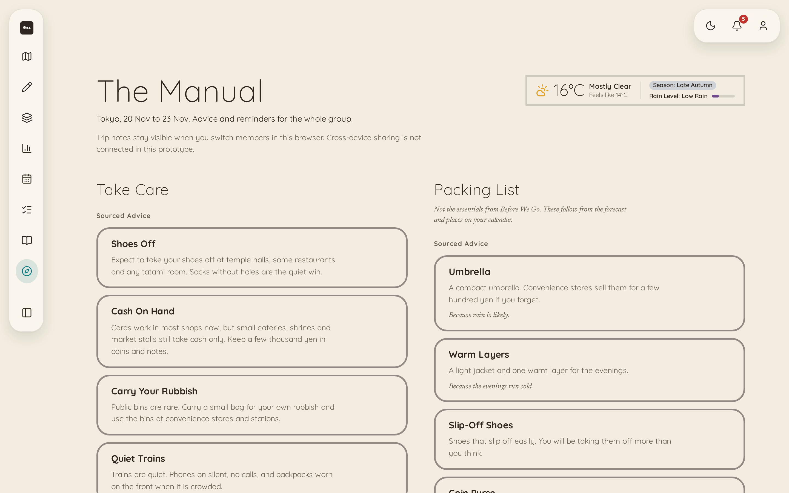

# Perch, By TolongLabs

| Submission Field        | Detail                                                                                                                                                                                                      |
| ----------------------- | ----------------------------------------------------------------------------------------------------------------------------------------------------------------------------------------------------------- |
| **Team**                | **TolongLabs**: `@AlaskanTuna` (Fullstack, DevOps, Deployment), `@chaosiris` (Frontend, Backend, Design), `@DrxgClanPC` (Ideation, Prototyping, Testing), `@Doraemon-00` (Documentation, Research, Testing) |
| **Problem Statement**   | Travel Planner, Track 1: Lifestyle & Personal Productivity                                                                                                                                                  |
| **UI Prototype**        | **https://prototype-yskhynz4la-as.a.run.app** (public, opens in incognito, no account required)                                                                                                             |
| **Video Presentation**  | [Unlisted YouTube Link] _(Video walkthrough; mastering and final edit in progress)_                                                                                                                         |
| **Presentation Slides** | [`demo/slides.pdf`](demo/slides.pdf) (18 pages, structured directly against the judging rubric)                                                                                                             |

> **Every tool a group already uses can produce a plan. None of them turns the group's decision into days. Perch does,
> and prints them.**

---

## 1. Project Overview

### The Problem

**The brief names it, and we quote it rather than paraphrase it:** _"when something changes mid-trip, there's rarely any
real help from existing platforms in adjusting."_

**The symptom is that planning a trip is a hassle. The causes are four, and only the fourth is unserved.** We are not
competing with Wanderlog; we are competing with the stack of free apps a group already has (WhatsApp, Google Maps, and a
money tool), which is why the first three rows are not ours.

| Cause                                                       | Who Serves It Today                                             | Ours?             |
| ----------------------------------------------------------- | --------------------------------------------------------------- | ----------------- |
| Producing a plausible itinerary is slow                     | **Solved.** Chatbots commoditised it                            | No                |
| The plan lives in five places at once                       | **Partly solved.** Wanderlog puts itinerary and map in one view | No                |
| Getting a group to decide                                   | **Partly solved.** WhatsApp polls and swipe apps produce a vote | Only as the input |
| **Turning that decision into scheduled, costed, kept days** | **Nobody.** The vote stays a vote and the plan is a screenshot  | **Yes**           |

**The stakeholders are not who the category sells to.** One person in every group does the planning, and the cost is not
that the plan is hard to make; it is who turns thirty opinions in a chat into four days that hold.

| Stakeholder                     | What They Carry Today                                                              |
| ------------------------------- | ---------------------------------------------------------------------------------- |
| **The organiser**               | Reading the whole chat, deciding for everyone, and the social cost of chasing them |
| **The other three**             | Nothing, which is the problem. No stake means no reply                             |
| **The person who fronts money** | The deposit, then a month of asking                                                |

### Similar Apps, And Where They Fall Short

**We are not competing with a travel planner. We are competing with a stack of free apps she already has.** Four
competitor passes are in [`research/market/`](research/market/); the two most relevant products were read directly
rather than from a summary.

| Product                                      | What It Does Well                                                         | Where It Falls Short                                                                                                                                                     |
| -------------------------------------------- | ------------------------------------------------------------------------- | ------------------------------------------------------------------------------------------------------------------------------------------------------------------------ |
| **[Wanderlog](https://wanderlog.com)**       | "Your itinerary and your map in one view" - its own tagline               | The plan is a document it stores. Nothing watches it, so a closed stop is still the group's problem                                                                      |
| **[Roadtrippers](https://roadtrippers.com)** | Suggestion quality, from "over 42 million trips"                          | Route-shaped and single-traveller. No group preference, no repair                                                                                                        |
| **[SwipeSights](https://swipesights.com)**   | **Computes a ranked group preference order**, super-likes weighted double | **It spends that ranking on how long you stay.** The losing swipes are discarded. Its own FAQ tells the group to _"double-check opening hours closer to your trip date"_ |
| **Google Maps**                              | Holds the pins, and everyone already has it                               | Holds places, not decisions. Its own reviewers call collaborative editing glitchy and not real-time                                                                      |
| **WhatsApp**                                 | Free, open, and where the trip already lives. **The real incumbent**      | A poll produces a result, not a plan. Nobody turns thirty votes into a routed itinerary                                                                                  |

> Every tool a group already uses can produce a plan. **None of them owns the plan afterwards.**

**A direct competitor had the ranking in its hands and spent it on a different problem.** That is a better originality
argument than "nobody does this", and unlike that claim it is checkable.

### Target Group Alignment And Scalability

**The beachhead target is urban Malaysian Gen-Z friend groups (3-4 travellers) taking short-haul self-guided trips.**
One organiser carries the planning burden across WhatsApp chats, while friends disengage until arrival. Perch gives the
organiser a decision tool and friends a zero-friction swipe deck requiring no accounts or app installations.

**Scalability operates through a dual viral loop.** Each new trip immediately invites three new peer users into the Deck
without onboarding friction. Upon completion, trips produce shareable digital spreads and printable keepsake books
bearing QR links that seed organic trip creation across new traveller cohorts.

### Our Solution

**The group swipes on reels of places, the owner drags what won onto a three-slot-a-day calendar, a heuristic orders
each day and colours it by how well the route holds, and the finished trip prints as The Book.**

The decision the group makes in swipes survives intact to a printed keepsake, passing only through the organiser's
hands. One unbroken chain, and the feature list below reflects that sequence in order.

| Feature          | What It Does                                                                                                                                       |
| ---------------- | -------------------------------------------------------------------------------------------------------------------------------------------------- |
| **Onboarding**   | A drawn month tapped twice for dates, activity and destination chips, and a free-text field that appears only under Other; only Tokyo continues    |
| **The Deck**     | The invite link. Each place is a reel; friends swipe yes or no with no account and no install                                                      |
| **The Tally**    | A percentage per place. The owner's swipe weighs 1.5; unanimous places go gold, places nobody wanted are greyed                                    |
| **The Desk**     | Four days, three to six slots each. She drags what won into slots, pins what must not move, and Optimize Plan orders every day around it           |
| **Feasibility**  | Each day is green, gold, or red with a stated reason: it holds, it holds but the order is slow, or a stop is outside hours                         |
| **The Perch**    | Remove a card and the drawer offers the next-ranked voted-in place for that slot, so the trip cannot empty                                         |
| **Before We Go** | A checklist derived from the trip itself; completing all items unlocks the Book and the Handbook                                                   |
| **The Book**     | The shared link and keepsake. A day is a spread: two stops to a page, poster frames as torn plates, the day's drawn route pinned on the first page |
| **The Handbook** | Customs and packing derived from trip facts and authored news triggers; displayed news is filtered strictly to trip dates                          |

**The scheduler is a heuristic and the copy never calls it AI**: cluster by area per day, order by best period and
opening hours, nearest neighbour within the day. Its colours are the explanation, and every red carries the reason.

---

## 2. Ideation & Process

**The ideation notebook is [`research/`](research/), kept whole.** It is plain-language, dated, and was written as the
thinking happened rather than reconstructed afterwards. Everything in this section is quoted from files in it, and each
file is linked so a reviewer can read the original rather than our summary of it.

### 2.1 Ideas We Considered

**Chosen ideas are listed first, followed by the directions we dropped.** Reasons quote the notebook's own words, not a
tidier version written afterwards.

| Idea                                                                          | Kept Or Dropped | Why                                                                                                                                                                                                                                                                                                   |
| ----------------------------------------------------------------------------- | --------------- | ----------------------------------------------------------------------------------------------------------------------------------------------------------------------------------------------------------------------------------------------------------------------------------------------------- |
| **Swipe on reels, drag what won, a heuristic orders the day** (chosen 8 Sept) | **Kept**        | The rebuild after mentor session 1, in [`research/decisions/rebuild-verdict-2026-09-08.md`](research/decisions/rebuild-verdict-2026-09-08.md): _"Actively thinking is harder than just deciding yes or no."_ The group's decision, made in swipes, reaches a printed book untouched                   |
| **The trip as a storybook, read-only when finished**                          | **Kept**        | A keepsake has to be a finished thing. The Book is printed state only, one plate per day, and it is what the group keeps                                                                                                                                                                              |
| **The self-repairing itinerary** (chosen 4 Sept, dropped 8 Sept)              | **Dropped**     | It needed a disruption fired by hand and a bench nobody had voted for, and _"the video now has to carry what the interaction used to show"_. After the mentor session the claim moved from repairing a plan to turning the group's decision into days; the ranked losers survived as the Perch drawer |
| **The interview instead of a form**                                           | **Dropped**     | _"I have to click a lot and I have to know what I want."_ Replaced on 8 Sept by onboarding with free text first and the swipe deck, which asks nothing the friend has to compose                                                                                                                      |
| **Map-first planner with a round-trip decision** (the original idea)          | **Superseded**  | "Stopped claiming the planner as novel; narrowed the claim to the round trip" - then Contour and calimoto were found shipping loops                                                                                                                                                                   |
| **Split planning: members claim days to fill**                                | **Dropped**     | "Splitting the work between four people does not remove the work, it distributes it." Killed by a teammate's question, and it was already built and working                                                                                                                                           |
| **One book in two states, voting inside the flipbook**                        | **Dropped**     | "A flipbook is built for reading, and hosting vote widgets and swap menus inside one fights the format." **It demoed better and still lost**                                                                                                                                                          |
| **Group voting as the originality claim**                                     | **Dropped**     | "Tripeza, SwipeSights and Plan Harmony all ship vote-then-generate for groups"                                                                                                                                                                                                                        |
| **Photo spots as a feature**                                                  | **Dropped**     | "It is a whole product category - Locationscout has 233,000 spots"                                                                                                                                                                                                                                    |
| **All-in-one platform as the differentiation argument**                       | **Dropped**     | "The incumbents own breadth, and five thin pages cost more under Feasibility than they gain under Creativity"                                                                                                                                                                                         |
| **A chat panel for planning**                                                 | **Dropped**     | "Conversational planning is where ChatGPT and TripGenie win." It also invites the one comparison we lose                                                                                                                                                                                              |
| **Bill splitting**                                                            | **Dropped**     | Every panel answer said the arithmetic is fine and **the collection is the problem**. Solving the half that already works                                                                                                                                                                             |
| **A mascot copilot**                                                          | **Dropped**     | It makes the plan feel authored, when its whole value is that it is derived                                                                                                                                                                                                                           |

**Two of those directions were dropped after being built and working**, and both write-ups state what it cost us to drop
them. [`research/decisions/dropped.md`](research/decisions/dropped.md) records them in full, including the cost
breakdown for each.

### 2.2 Ideation Boards


**Six days of ideation drawn as a tree**: what we claimed, what got built, the three competitor scans, the four branches
we dropped, and the marks still unclaimed. The dropped branches are on the page deliberately rather than only in the
decisions log.


**What a group actually does, stage 0 to stage 8**, and the loop back from "it broke" to "the plan re-derives". The
mindmap shows how the thinking moved; this shows the product it produced.

**Both diagrams are exports.** The Obsidian Canvas sources live in [`research/diagrams/`](research/diagrams/), alongside
the Python script that renders them, so either can be regenerated rather than redrawn.

**The written trail underneath them is the substance**, and it is longer than two pictures.

| Record                                                                       | What Is In It                                                                             |
| ---------------------------------------------------------------------------- | ----------------------------------------------------------------------------------------- |
| [`research/decisions/iteration-log.md`](research/decisions/iteration-log.md) | **Over fifty dated turns**, each with what changed, why, and what triggered it            |
| [`research/decisions/dropped.md`](research/decisions/dropped.md)             | Full write-ups of directions abandoned, including what dropping each one cost             |
| [`research/market/`](research/market/)                                       | Four competitor passes, with every source graded by whether the page was actually read    |
| [`research/users/`](research/users/)                                         | The persona, every claim marked `[assumed]`, and a synthetic panel marked as not evidence |
| [`research/inbox/`](research/inbox/)                                         | The raw dumps the ideas came out of, unedited                                             |

### 2.3 Mentor Consultation

| Date        | Mentor                                                                            | Feedback Received                                                                                                                                                                                                                                                  | What Was Changed                                                                                                                                                                                 |
| ----------- | --------------------------------------------------------------------------------- | ------------------------------------------------------------------------------------------------------------------------------------------------------------------------------------------------------------------------------------------------------------------ | ------------------------------------------------------------------------------------------------------------------------------------------------------------------------------------------------ |
| 7 Sept 2026 | **Zach Khong**, Full Stack Engineer at Solana Foundation, Cursor hackathon winner | _"All these features right, like one to six, is stuff that people will already build."_ Nine of his twelve teams are building a travel planner. Voting is table stakes; _"the way that how you represent the voting feature is what would make your app special."_ | Voting rebuilt as a swipe deck of reels, one place per card, the name set small under the picture so the decision is made on the image. The flow reframed as **vibe based planning**, his phrase |
|             |                                                                                   | _"I have to click a lot and I have to know what I want."_ _"The results could be nice UI, but the data collection could be just unstructured text."_                                                                                                               | The onboarding collapsed to one screen where free text comes first and choice chips are shortcuts under it. The eat-shop-do page and its separate vote step were dropped                         |
|             |                                                                                   | _"I feel like the voting part is a bit stiff"_ - a 50-50 split had no answer. _"Actively thinking is harder than just deciding yes or no."_                                                                                                                        | The 50-50 case is settled by the plan owner's swipe carrying tie-break weight, and the pre-trip plan proposes so the group only accepts or rejects                                               |
|             |                                                                                   | _"Being specific can definitely be your strength... you could plan to that level of cultural detail."_                                                                                                                                                             | The demo trip is Japan for Aisyah, with transit times between areas modelled rather than a generic international planner                                                                         |
|             |                                                                                   | _"Voting doesn't have to be yes or no. You could be like, oh, I like this place like maybe 65 percent."_                                                                                                                                                           | **Not changed yet.** Binary swipe ships in the mockup; a strength-of-swipe spectrum is logged as the first candidate for the build phase                                                         |

**The full session is transcribed verbatim** at
[`source/mentor-session-1-transcript.md`](source/mentor-session-1-transcript.md): 38 minutes, Whisper-transcribed with
timestamps preserved, alongside a curated index of the core architectural quotes.

**What the session did not endorse is recorded too.** He proposed a group chat with an AI reading it and drawing on a
map. Both appear in the transcript and neither was adopted: a chat panel invites the "why not ChatGPT" comparison, and a
canvas does not survive a five-minute demo. A Fruit Ninja slice gesture was also dropped during the call.

---

## 3. Design & Prototype

| Link                                                                   | What Is In It                                      | Access                         |
| ---------------------------------------------------------------------- | -------------------------------------------------- | ------------------------------ |
| **[The running prototype](https://prototype-yskhynz4la-as.a.run.app)** | The built app. Redeployed on every merge to `main` | **Public, opens in incognito** |

**The two Figma files** — the greyscale wireframe and the visual mockups — are listed with their contents and access
notes in [`DESIGN.md`](DESIGN.md#the-figma-files), which is where the design spec they realise also lives.

**Greys are deliberate.** The wireframe was drawn before [`DESIGN.md`](DESIGN.md) existed so that structure could be
judged without visual direction leaking into it, and so a structural problem and a styling problem never get argued
about at the same time.

### Nine Key Screens From The Running Build

The core flow moves across nine responsive surfaces, displayed in order below:

|                                         Landing                                         |                                            Dashboard                                             |                                            Onboarding                                            |
| :-------------------------------------------------------------------------------------: | :----------------------------------------------------------------------------------------------: | :----------------------------------------------------------------------------------------------: |
| [](https://prototype-yskhynz4la-as.a.run.app/) | [](https://prototype-yskhynz4la-as.a.run.app/trips) | [](https://prototype-yskhynz4la-as.a.run.app/new) |
|                     Stated mechanism with two instant entry points                      |                        Trip status card and remaining-friend invite link                         |                             Drawn month picker and free-text intent                              |

|                                                  The Deck                                                   |                                                   The Tally                                                   |                                         The Desk                                          |
| :---------------------------------------------------------------------------------------------------------: | :-----------------------------------------------------------------------------------------------------------: | :---------------------------------------------------------------------------------------: |
| [](https://prototype-yskhynz4la-as.a.run.app/t/tokyo-nov-2026/swipe) | [](https://prototype-yskhynz4la-as.a.run.app/t/tokyo-nov-2026/votes) | [](https://prototype-yskhynz4la-as.a.run.app/desk) |
|                                    Zero-install swipe reels with Must Go                                    |                                   Weighted group tally with 1.5× owner bias                                   |                      Drag-and-drop calendar with heuristic ordering                       |

|                                                    Before We Go                                                    |                                               The Book                                                |                                                  The Handbook                                                  |
| :----------------------------------------------------------------------------------------------------------------: | :---------------------------------------------------------------------------------------------------: | :------------------------------------------------------------------------------------------------------------: |
| [](https://prototype-yskhynz4la-as.a.run.app/desk/before-we-go) | [](https://prototype-yskhynz4la-as.a.run.app/t/tokyo-nov-2026) | [](https://prototype-yskhynz4la-as.a.run.app/desk/before-we-go) |
|                                   Contextual checklist unlocking export surfaces                                   |                            Seven-spread keepsake flipbook with drawn route                            |                                Dynamic packing list and trip-filtered etiquette                                |

**Every step is a real, interactive surface in the deployed prototype rather than a static concept.** Captured frames
reflect the live release; ongoing control refinements appear on the public URL.

**The six phone screens are captured at 390 by 844 and the three desktop screens at 1440 by 900.** Every screen is
rendered at double scale for high-density clarity. Proportions differ by design to match user context.

The Desk, The Book, and The Handbook are built for wide displays: four day columns and two-page spreads require visual
air. The product story has friends swiping on phones from an invite link while the organiser shapes the days at a desk.

**The Prototype Controls block on The Desk is labelled as test instrumentation.** The trip lives in browser state
without accounts, so fixture reset controls ensure reliable reviewer evaluation without developer tools.

**The design direction is a field guide, not a travel brochure.** [`DESIGN.md`](DESIGN.md) documents its typography,
proportions, and palette, drawn from historical specimen guides and direct Japanese source studies in
[`design/`](design/).

---

## 4. What Makes It Different

**One novel chain, and we are deliberately not claiming more than one.**

| What                                                      | Why It Is Novel, Or What The Twist Is                                                                                                                                                    |
| --------------------------------------------------------- | ---------------------------------------------------------------------------------------------------------------------------------------------------------------------------------------- |
| **The Swipes Become The Calendar**                        | SwipeSights computes a ranked group preference and spends it on how long you stay. **We Spend It On The Days**: the tally is the scheduler's pool, with the owner's pins the only bypass |
| **The losing swipes are kept and spent**                  | Every voting product discards what lost. The ranked voted-in list survives as the Perch drawer, so removing a card offers the next place the group already said yes to                   |
| **Owner Vote Weight And Pins**                            | The owner's swipe weighs 1.5, only 33 percent of the four-person seed, so their vote alone cannot carry a place in. **A pin can still place a card -- a Desk act, not a vote**           |
| **The day explains itself in colour**                     | Green, gold, or red per day with the reason stated: the order is slow by so many minutes, or this stop is shut on Monday. **A heuristic that says what it did, never called AI**         |
| **The invite link is the deck, the keepsake is the book** | Friends land on reels and swipe with nothing installed; what they get back is a printed book of the trip they chose. **The book is not a reward at the end, it is why they swipe**       |

### Against The Products We Named

| Feature Capability                       | Wanderlog | Roadtrippers | SwipeSights | Google Maps + WhatsApp |  Perch  |
| ---------------------------------------- | :-------: | :----------: | :---------: | :--------------------: | :-----: |
| Builds an itinerary                      |    Yes    |     Yes      |     Yes     |           No           |   Yes   |
| Combines group preferences               |    No     |      No      |   **Yes**   |       Poll only        |   Yes   |
| **Keeps the losing preferences**         |    No     |      No      |   **No**    |           No           | **Yes** |
| **Schedules the votes into routed days** |    No     |      No      |     No      |           No           | **Yes** |
| **Says in colour whether a day holds**   |    No     |      No      |     No      |           No           | **Yes** |
| Works with no account and no install     |    No     |      No      |     No      |        **Yes**         | **Yes** |

**What we do not claim** is as important, and [`PRODUCT.md`](PRODUCT.md#what-we-claim-and-what-we-do-not) lists six
non-claims with the rationale for each: not better suggestions, not that generating an itinerary is hard, not a new
layout, not clever routing, not novel group voting, and not photo spots.

**The honest risk:** Troupe ships ranked group voting and **we have not read it**. If it already turns its votes into a
scheduled calendar, the originality claim is gone. It is named as the primary uncertainty in
[`PRD.md`](PRD.md#market-fit) rather than assumed away.

---

## 5. Technical Architecture & Feasibility

### Tech Stack

| Layer         | Choice                                           | Why, And What It Costs                             |
| ------------- | ------------------------------------------------ | -------------------------------------------------- |
| **Frontend**  | Vite 8, React 19, react-router-dom 7             | No SSR need, eliminating server rendering overhead |
| **Language**  | TypeScript strict, `noUncheckedIndexedAccess`    | Catches runtime boundary edge cases at compile     |
| **Tooling**   | Bun                                              | High-performance package manager and test runner   |
| **Styling**   | Plain CSS custom properties, zero CSS frameworks | One tokens file, scoped stylesheets per surface    |
| **Fonts**     | Quicksand and Newsreader, self-hosted woff2      | Zero external CDN dependencies during evaluation   |
| **State**     | React context synchronized to `localStorage`     | Validated with runtime type guards at boundaries   |
| **Data**      | Committed TypeScript fixtures                    | Versioned with the code, reviewable in git history |
| **Drag**      | `@dnd-kit/core`                                  | Accessible drag-and-drop for calendar slots        |
| **Backend**   | **None, by design, for the prototype**           | Zero server dependencies for deterministic demo    |
| **APIs**      | **None. Zero API keys**                          | Immune to external rate limits or token failures   |
| **Reels**     | Muted MP4 reels from public GCS bucket           | Fast media streaming for mobile swipe cards        |
| **Hero Clip** | Gemini-generated 10-second dawn loop             | Clean visual backdrop without third-party footage  |
| **Hosting**   | Google Cloud Run, `asia-southeast1`              | Containerized serverless delivery, scales to zero  |
| **CI/CD**     | GitHub Actions automated pipeline                | Automatic build and deploy on merges to `main`     |
| **Container** | Two-stage `Dockerfile`: Bun builds, nginx serves | Isolated reproducible image compilation            |

<a id="deployment"></a>

### Deployment And Hosting

The application is deployed on **Google Cloud Run** in `asia-southeast1` via automated continuous integration.

- **Container build**: Two-stage `Dockerfile` uses Bun for compilation and Nginx 1.27 Alpine for static delivery.
- **Routing fallback**: `nginx.conf` routes legacy `/v1/` mockups directly and directs all SPA routes (`/t/<trip>`) to
  `index.html`.
- **Security**: Deployments use Google Cloud Workload Identity Federation with zero long-lived repository secrets.
- **Why not Vercel**: Vercel's free hobby tier restricts automatic builds to repository owner commits, blocking
  collaborative team deployments. Cloud Run serves all team commits uniformly.

### System Architecture

The prototype uses a deterministic, client-first architecture compiled and verified via Archify.

[](assets/architecture.html)

_System map generated with [Archify](https://github.com/tt-a1i/archify). Click diagram to open the interactive,
searchable HTML artifact with live route tracing._

### Prototype Constraints & Execution Guarantees

- **Committed place fixtures**: 24 hand-authored Tokyo places across four distinct clusters with an embedded 24×24
  travel duration matrix (see [`ARCHITECTURE.md`](ARCHITECTURE.md#3-data-fixtures-and-spatial-matrix)).
- **Deterministic session closure**: Client-side evaluation records unvoted cards as skipped abstentions, keeping the
  full-party denominator intact (see [`TRD.md`](TRD.md#voting-session)).
- **Zero third-party media**: Dawn aerial hero loop was generated with Google Gemini Videos. Curated reels are
  attributed in [`v2/src/data/reels.json`](../v2/src/data/reels.json) (see
  [`ARCHITECTURE.md`](ARCHITECTURE.md#4-media-provenance-and-assets)).
- **Pure CSS 3D mechanics**: The Book's page turn adapts `create-photo-flipbook-ui` (MIT) principles in CSS without
  Three.js or WebGL runtime dependencies (see [`ARCHITECTURE.md`](ARCHITECTURE.md#5-css-3d-flipbook-mechanics)).

### Build Phase Additions

The building phase (21 September - 11 October) introduces focused backend capabilities to the proven prototype:

- **Supabase**: Realtime multi-user voting synchronization and persistent trip records.
- **Seeded place database**: Automated data ingestion from OpenStreetMap, Wikidata, and Wikimedia Commons.
- **Transit integration**: Google Routes API for live transit duration validation.
- **Natural language intent**: LLM-assisted intent extraction for free-text onboarding inputs (heuristic scheduler
  remains strictly deterministic).

### Build Plan & Scope

| Week                         | Focus Area                 | Scope And Deliverables                                                                                           |
| ---------------------------- | -------------------------- | ---------------------------------------------------------------------------------------------------------------- |
| **Week 1 (21 - 27 Sept)**    | Supabase Integration       | Schema deployment, multi-user auth, and realtime vote synchronization across invite links.                       |
| **Week 2 (28 Sept - 4 Oct)** | Automated Place Seeding    | OpenStreetMap and Wikidata ingestion pipeline replacing static JSON fixtures with validated geographic data.     |
| **Week 3 (5 - 11 Oct)**      | Routing & Intent Parsing   | Google Routes API integration for transit legs, plus LLM-based onboarding intent parsing and schedule rationale. |
| **Freeze (12 - 31 Oct)**     | Deployment & Bug Hardening | Strict bug fixes and performance optimization only. No major feature additions per competition rules.            |

**Explicitly out of scope for the build phase**: native mobile apps, international destinations outside Japan, and
conversational AI chatbot assistants.

---

## 6. Repository Layout & Documentation Index

<a id="layout"></a>

### Repository Layout

```
docs/
  README.md              This file: submission deliverable and project landing page
  ARCHITECTURE.md        Technical architecture, media provenance, CSS mechanics, and data contracts
  DEVELOPMENT.md         Local developer setup, test suites, and deployment reference
  PRODUCT.md             Product spine: user problem, thesis, demo moments, and scope ladder
  PRD.md                 Product requirements, user stories, and acceptance criteria
  TRD.md                 Technical reference: data models, scheduler algorithm, and contracts
  DESIGN.md              Design system: field-guide palette, tokens, and typography
  brief.md               CodeNection 2026 competition brief, rules, and rubric bands
  assets/                Captured interface screens, Archify architecture map, and ideation SVGs
  research/              Ideation notebook: dated turns, market scans, user research, and dropped ideas
  source/                Verbatim organiser material, kickoff transcripts, and mentor logs
  demo/                  Slide deck PDF, video script, and demo recording assets
v1/                      Legacy static HTML mockup, preserved at /v1/
v2/
  index.html             Vite application entry point
  public/                Self-hosted fonts (Quicksand, Newsreader) and brand marks
  src/
    data/                Data models, Tokyo place fixtures, and seeded trip state
    lib/                 Deterministic scheduler, tally logic, persistence, and tests
    surfaces/            Application surfaces: Landing, Dashboard, Onboarding, Deck, Tally, Desk, Book, Handbook
    components/          Modular UI components: ReelCard, PlacedCard, Drawer, StateChip
    styles/              Design tokens (`tokens.css`) and surface stylesheets (`base.css`)
scripts/demo/            Demo recorder pipeline and audio narration scripts
Dockerfile               Two-stage multiplatform build (Bun compile + Nginx static server)
nginx.conf               Production web server configuration with SPA routing fallback
vite.config.ts           Vite configuration rooting application in v2/
```

### Documentation Guide

| Document                             | Focus And Audience                                                                     |
| ------------------------------------ | -------------------------------------------------------------------------------------- |
| [`DEVELOPMENT.md`](DEVELOPMENT.md)   | **Developers**: Setup, local commands, linting, test suites, and git contribution      |
| [`ARCHITECTURE.md`](ARCHITECTURE.md) | **Architecture**: System boundaries, media provenance, CSS 3D mechanics, and contracts |
| [`PRODUCT.md`](PRODUCT.md)           | **Product Strategy**: User persona, core thesis, scope ladder, and non-claims          |
| [`PRD.md`](PRD.md)                   | **Requirements**: User stories, functional requirements, and acceptance criteria       |
| [`TRD.md`](TRD.md)                   | **Technical Reference**: Data schemas, scheduler specification, and state contracts    |
| [`DESIGN.md`](DESIGN.md)             | **Design System**: Field-guide aesthetics, color tokens, and typography studies        |
| [`research/`](research/)             | **Ideation Notebook**: 50+ dated turns, dropped concepts, and competitor evaluations   |
| [`brief.md`](brief.md)               | **Competition Brief**: Rules, deadlines, deliverables, and judging rubric criteria     |
| [`source/`](source/)                 | **Organiser Sources**: Verbatim transcripts and official kickoff documentation         |

---

**Submission Note.** This `README.md` is the primary submission surface for **CodeNection 2026 (Track 1: Lifestyle &
Personal Productivity)**. All assets, ideation records, design artifacts, and technical specifications are linked
directly within this repository.
