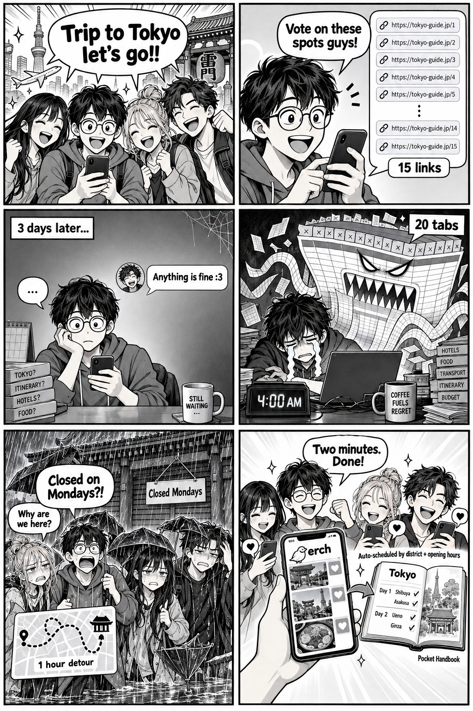
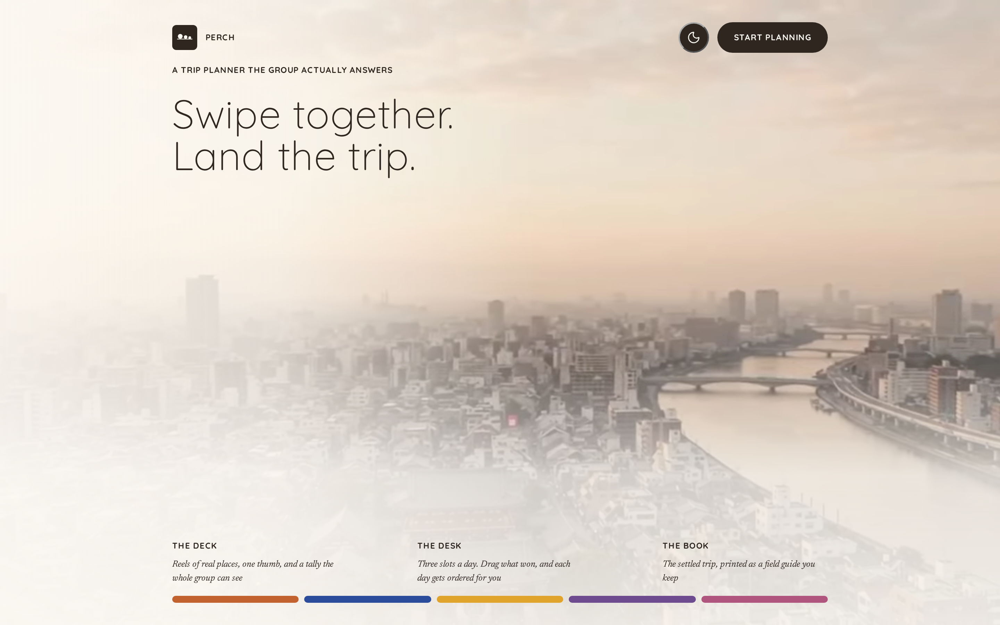
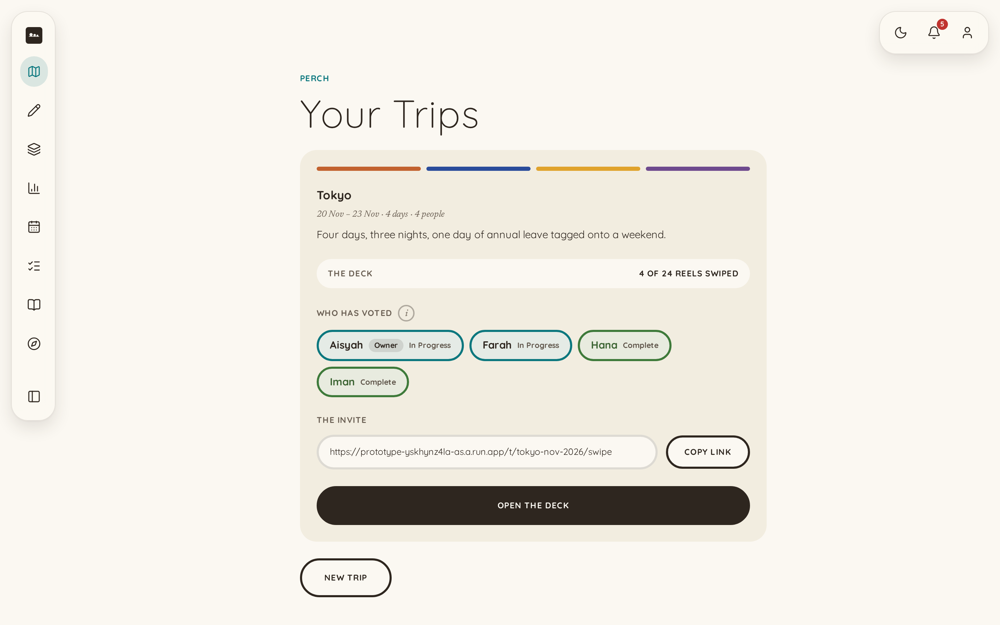
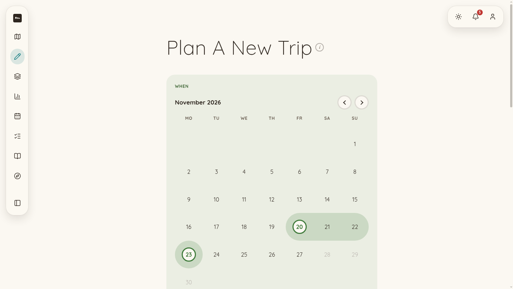
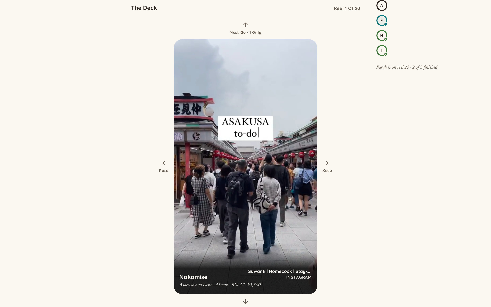
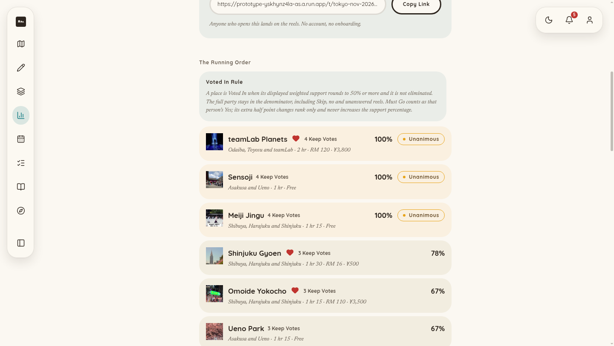
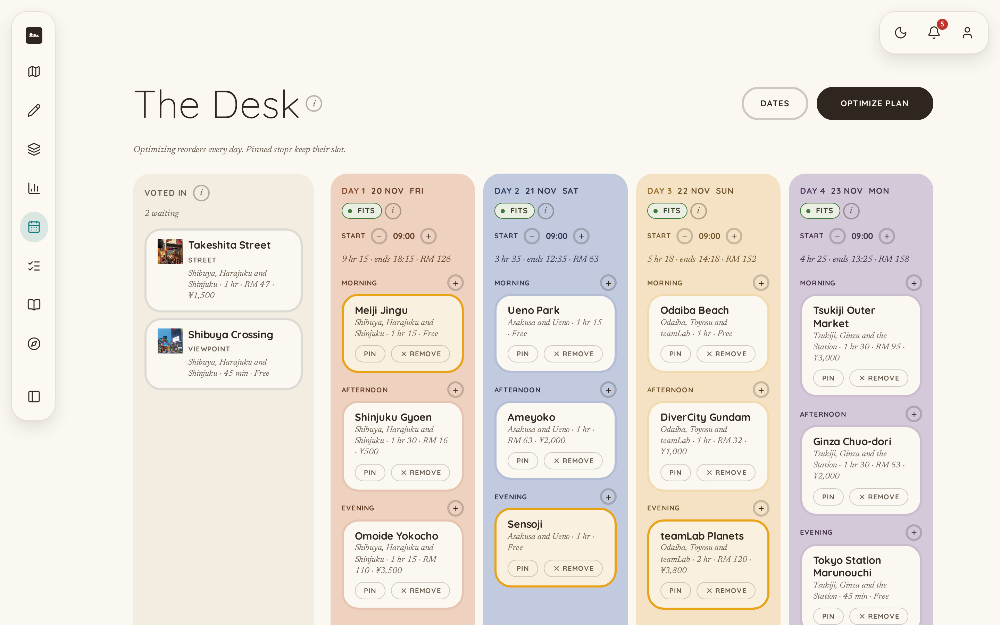
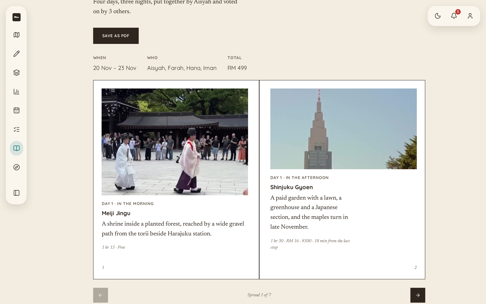
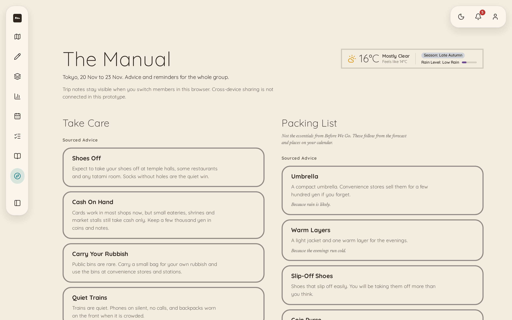
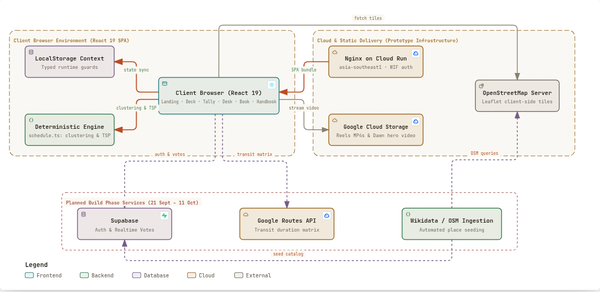

<a id="readme-top"></a>

<div align="center">
  

  <h3>Perch</h3>

  <p>
    <b>Turn group decisions into scheduled, costed, kept days.</b><br />
    Friends swipe on reels; the organiser shapes the days; the trip prints as a keepsake book.
  </p>


[Live Prototype](https://prototype-yskhynz4la-as.a.run.app) · [Slides](demo/slides.pdf) · [PRODUCT](PRODUCT.md) ·
[PRD](PRD.md) · [TRD](TRD.md) · [Architecture](ARCHITECTURE.md) · [Design](DESIGN.md)

</div>

| Submission Field        | Detail                                                                                                                                                  |
| ----------------------- | ------------------------------------------------------------------------------------------------------------------------------------------------------- |
| **Team**                | **TolongLabs**: `@AlaskanTuna` (Fullstack, DevOps, Deployment), `@chaosiris` (Frontend, Backend, Design), `@DrxgClanPC` (Ideation, Prototyping, Testing), `@Doraemon-00` (Documentation, Research, Testing) |
| **Problem Statement**   | Travel Planner, Track 1: Lifestyle & Personal Productivity                                                                                              |
| **UI Prototype**        | **https://prototype-yskhynz4la-as.a.run.app** (public, opens in incognito, no account required)                                                         |
| **Video Presentation**  | **https://youtu.be/2n6SeH6D5bg** (unlisted)                                                                                                             |
| **Presentation Slides** | [`demo/final-slides.pdf`](demo/final-slides.pdf) (12 pages, structured against the judging rubric). The long cut, [`demo/slides.pdf`](demo/slides.pdf), carries all 19 |

## Table Of Contents

<details>
  <summary>Expand</summary>
  <ol>
    <li>
      <a href="#1-project-overview">Project Overview</a>
      <ol>
        <li><a href="#11-the-problem">The Problem</a></li>
        <li><a href="#12-aims--objectives">Aims & Objectives</a></li>
        <li><a href="#13-target-users">Target Users</a></li>
        <li><a href="#14-similar-apps-and-where-they-fall-short">Similar Apps And Where They Fall Short</a></li>
        <li><a href="#15-our-solution">Our Solution</a></li>
      </ol>
    </li>
    <li>
      <a href="#2-ideation--process">Ideation & Process</a>
      <ol>
        <li><a href="#21-ideas-we-considered">Ideas We Considered</a></li>
        <li><a href="#22-ideation-boards">Ideation Boards</a></li>
        <li><a href="#23-mentor-consultation">Mentor Consultation</a></li>
      </ol>
    </li>
    <li>
      <a href="#3-design--prototype">Design & Prototype</a>
      <ol>
        <li><a href="#31-core-interface-walkthrough">Core Interface Walkthrough</a></li>
        <li><a href="#32-design-principles">Design Principles</a></li>
      </ol>
    </li>
    <li>
      <a href="#4-what-makes-it-different">What Makes It Different</a>
      <ol>
        <li><a href="#41-five-novel-twists">Five Novel Twists</a></li>
        <li><a href="#42-competitor-comparison">Competitor Comparison</a></li>
        <li><a href="#43-boundaries-and-uncertainties">Boundaries And Uncertainties</a></li>
      </ol>
    </li>
    <li>
      <a href="#5-technical-architecture--feasibility">Technical Architecture & Feasibility</a>
      <ol>
        <li><a href="#51-system-architecture">System Architecture</a></li>
        <li><a href="#52-tech-stack">Tech Stack</a></li>
        <li><a href="#53-deployment-and-hosting">Deployment And Hosting</a></li>
        <li><a href="#54-prototype-constraints--guarantees">Prototype Constraints & Guarantees</a></li>
        <li><a href="#55-three-week-build-plan">Three-Week Build Plan</a></li>
      </ol>
    </li>
    <li>
      <a href="#6-repository-layout--documentation">Repository Layout & Documentation</a>
      <ol>
        <li><a href="#61-project-structure">Project Structure</a></li>
        <li><a href="#62-documentation-index">Documentation Index</a></li>
      </ol>
    </li>
    <li><a href="#7-team">Team</a></li>
  </ol>
</details>

---

## 1. Project Overview

### 1.1 The Problem

<p align="center">
  
</p>

The competition brief identifies the core friction directly: _"when something changes mid-trip, there's rarely any real
help from existing platforms in adjusting."_

The symptom is that group travel planning stalls. Four root causes drive this breakdown, but only the fourth remains
unsolved across modern consumer software:

| Cause                                                     | Who Serves It Today                                                       | Ours?         |
| --------------------------------------------------------- | ------------------------------------------------------------------------- | ------------- |
| Producing a plausible itinerary is slow                   | **Solved.** Conversational AI commoditised initial itinerary drafting     | No            |
| Trip details scatter across separate apps                 | **Partly solved.** Wanderlog unifies maps and lists into one view         | No            |
| Reaching consensus across group preferences               | **Partly solved.** WhatsApp polls and swipe apps capture raw votes        | Only as input |
| **Turning group consensus into scheduled, feasible days** | **Unserved.** Losing votes are discarded and schedules become screenshots | **Yes**       |

One person in every travelling group carries the planning burden. The emotional friction is not drafting stops, but
negotiating thirty opinions in chat into a coherent itinerary:

| Stakeholder           | Current Pain                                                                         |
| --------------------- | ------------------------------------------------------------------------------------ |
| **The Organiser**     | Reads conversational clutter, resolves conflicts alone, and shoulders social chasing |
| **The Group Members** | Disengage without skin in the game, feeling detached from fixed itineraries          |
| **The Financier**     | Fronts large deposits and absorbs payment reconciliation delays                      |

### 1.2 Aims & Objectives

Perch transforms how small travel groups decide, assemble, and remember their shared journeys. Rather than generating
static text blocks, Perch solves the breakdown between consensus and executable logistics.

| Target Area             | Core Objective                                                                                 |
| ----------------------- | ---------------------------------------------------------------------------------------------- |
| **Frictionless Intake** | Collect group preferences via zero-install mobile web reels without requiring accounts         |
| **Deterministic Days**  | Synthesize weighted group votes into feasible daily routes using transparent transit intervals |
| **Dynamic Continuity**  | Cache runner-up choices to enable instant, dispute-free stop replacement when disruptions hit  |
| **Tangible Keepsakes**  | Publish finalized itineraries as interactive digital flipbooks and printable souvenir guides   |

### 1.3 Target Users

The beachhead market is **urban Malaysian Gen-Z friend groups (3–4 travellers)** undertaking self-guided short-haul
trips across East and Southeast Asia.

| User Persona            | Role & Behaviour                                                                             |
| ----------------------- | -------------------------------------------------------------------------------------------- |
| **The Organiser**       | Initiates trip setup, resolves schedule trade-offs, and holds a 1.5× tie-breaker vote        |
| **The Group Member**    | Swipes binary Yes/No on curated reels from group chat links with zero onboarding barrier     |
| **The Extended Circle** | Views exported keepsakes post-trip, driving viral organic adoption through embedded QR links |

Growth scales through a dual viral loop:

1. **Inbound invite loop**: Each trip invites 3+ friends into The Deck via WhatsApp with no account creation.
2. **Outbound keepsake loop**: Completed trips generate shareable digital flipbooks and printable PDFs that seed new
   trip creation.

### 1.4 Similar Apps And Where They Fall Short

Competitor evaluations in [`research/market/`](research/market/) demonstrate why existing stacks fail collaborative
travel:

| Product                                      | Strengths                           | Where It Falls Short                                                                |
| -------------------------------------------- | ----------------------------------- | ----------------------------------------------------------------------------------- |
| **[Wanderlog](https://wanderlog.com)**       | Unified itinerary and map display   | Static plan storage; offers no automatic schedule repair when stops close           |
| **[Roadtrippers](https://roadtrippers.com)** | Deep route database (42M+ trips)    | Tailored for individual drivers; lacks group voting and schedule feasibility        |
| **[SwipeSights](https://swipesights.com)**   | Ranked group preference calculation | Spends ranking purely on stay duration; discards losing votes and lacks routing     |
| **Google Maps**                              | Ubiquitous place catalog            | Stores individual pins, not coordinated schedules; collaborative editing is glitchy |
| **WhatsApp**                                 | Universal incumbent chat app        | Polls capture isolated votes, never synthesized into a feasible calendar            |

> Every tool a group already uses can produce a plan. **None of them owns the plan afterwards.**

### 1.5 Our Solution

The group swipes on short video reels of curated places. The organiser drags consensus winners onto a three-slot daily
desk, where a deterministic heuristic orders the route and highlights feasibility in colour. Completed itineraries
compile into The Book, a printable keepsake.

| Feature                | Job                                                                                     |
| ---------------------- | --------------------------------------------------------------------------------------- |
| **Onboarding**         | Visual month selector and free-text intent chips for rapid trip initialization          |
| **The Deck**           | Zero-friction web reel deck; friends vote Yes, No, or Must Go with no account required  |
| **The Tally**          | Weighted preference tally applying a 1.5× bias to the organiser's tie-breaking votes    |
| **The Desk**           | Multi-day drag-and-drop workspace with automated nearest-neighbour schedule ordering    |
| **Feasibility Engine** | Color-coded status (green, amber, red) flagging routing pace and operating hours        |
| **The Perch**          | Adaptive drawer preserving non-winning votes to replace dropped stops instantly         |
| **Before We Go**       | Pre-trip preparation checklist gating the generation of export documents                |
| **The Book**           | Seven-spread digital keepsake flipbook and printable PDF with custom illustrated routes |
| **The Handbook**       | Contextual etiquette guide and packing list filtered to specific trip dates             |

<p align="right"><a href="#readme-top">&uarr;</a></p>

---

## 2. Ideation & Process

The complete ideation trail is documented in [`research/`](research/). Every direction, decision record, and dropped
path was recorded in real time as the product evolved.

### 2.1 Ideas We Considered

Chosen directions appear first, followed by abandoned concepts with cited rationale from
[`research/decisions/`](research/decisions/):

| Idea                                        | Status         | Rationale                                                                                                  |
| ------------------------------------------- | -------------- | ---------------------------------------------------------------------------------------------------------- |
| **Swipe reels to drag-and-drop schedule**   | **Kept**       | Chosen 8 Sept after mentor consultation. Swiping eliminates decision friction while preserving group input |
| **Trips as printable keepsake books**       | **Kept**       | A shared journey deserves a definitive artifact; read-only publication prevents post-trip drift            |
| **Self-repairing itinerary on disruptions** | **Dropped**    | Required artificial mid-trip triggers; pivoted to converting pre-trip votes into resilient daily slots     |
| **Conversational chat onboarding**          | **Dropped**    | High user composition effort; replaced by single-screen free-text and category chip shortcuts              |
| **Map-first loop routing**                  | **Superseded** | Loop routing is commoditised by Calimoto and Contour; refocused on group consensus mechanics               |
| **Split planning across group members**     | **Dropped**    | Distributing planning tasks across four people fragmented ownership rather than reducing total work        |
| **Interactive voting inside 3D flipbook**   | **Dropped**    | Hosting complex voting controls inside a book format conflicted with reading ergonomics                    |
| **Generic group voting without routing**    | **Dropped**    | Vote tallying alone is table stakes; value lies in converting votes directly into feasible days            |
| **Dedicated photo spot directory**          | **Dropped**    | Commoditised feature (Locationscout has 233,000 spots); distracts from core planning mechanics             |
| **All-in-one travel mega-platform**         | **Dropped**    | Incumbents own breadth; shallow multi-feature platforms score poorly on feasibility                        |
| **AI conversational assistant panel**       | **Dropped**    | Invites direct comparison with general LLMs; our value is deterministic schedule derivation                |
| **Automated group bill splitting**          | **Dropped**    | Solves basic arithmetic rather than collection friction; better handled by existing payment apps           |
| **Mascot travel companion**                 | **Dropped**    | Artificial personality felt manufactured; travel plans derive authority from group consensus               |

Two of these carry full write-ups and cost assessments in
[`research/decisions/dropped.md`](research/decisions/dropped.md); the day each of the rest stopped being live is in
[`research/decisions/iteration-log.md`](research/decisions/iteration-log.md).

### 2.2 Ideation Boards


Six days of architectural evolution mapping explored problem spaces, competitor scans, and evaluated decision branches.


End-to-end user journey tracing group progression from initial invite through reel swiping, calendar assembly, and
keepsake publishing.

Source Obsidian Canvas diagrams and rendering pipelines live in [`research/diagrams/`](research/diagrams/). Additional
research assets are catalogued below:

| Record                                                                       | Contents                                                                       |
| ---------------------------------------------------------------------------- | ------------------------------------------------------------------------------ |
| [`research/decisions/iteration-log.md`](research/decisions/iteration-log.md) | 82 dated records: 52 log rows and 30 longer entries, each with what changed and what caused it |
| [`research/decisions/dropped.md`](research/decisions/dropped.md)             | Architectural analysis and rationale behind discarded directions               |
| [`research/market/`](research/market/)                                       | Direct competitive audits and breakdown matrices                               |
| [`research/users/`](research/users/)                                         | Persona hypotheses, assumed constraints, and group dynamics models             |
| [`research/inbox/`](research/inbox/)                                         | Unprocessed ideation fragments and workshop logs                               |
| [`research/mentors/`](research/mentors/)                                     | Structured mentor session records, alongside the verbatim transcript in `source/` |
| [`research/ideas/`](research/ideas/)                                         | The idea sheets each direction started from                                    |
| [`research/prototype/`](research/prototype/)                                 | The v1 mockups the ideation ran against                                        |

### 2.3 Mentor Consultation

| Date        | Mentor         | Feedback Received                                                                                                                                                      | What Was Changed                                                                                                 |
| ----------- | -------------- | ---------------------------------------------------------------------------------------------------------------------------------------------------------------------- | ---------------------------------------------------------------------------------------------------------------- |
| 7 Sept 2026 | **Zach Khong** | _"All these features right, like one to six, is stuff that people will already build... the way how you represent the voting feature is what makes your app special."_ | Rebuilt voting as visual swipe reels focusing on media over text, establishing "vibe-based planning"             |
| 7 Sept 2026 | **Zach Khong** | _"I have to click a lot and I have to know what I want. The data collection could be just unstructured text."_                                                         | Replaced multi-step forms with single-screen free-text input and destination shortcuts                           |
| 7 Sept 2026 | **Zach Khong** | _"I feel like the voting part is a bit stiff... Actively thinking is harder than just deciding yes or no."_                                                            | Assigned 1.5× tie-breaker weighting to trip organiser; transformed voting to binary Yes/No decisions             |
| 7 Sept 2026 | **Zach Khong** | _"Being specific can definitely be your strength... plan to that level of cultural detail."_                                                                           | Grounded prototype in authentic Tokyo places with realistic inter-neighbourhood transit intervals                |
| 7 Sept 2026 | **Zach Khong** | _"Voting doesn't have to be yes or no. You could be like, oh, I like this place like maybe 65 percent."_                                                               | **Logged for build phase**: Kept binary cards for prototype speed; logged continuous preference slider for build |

Verbatim transcripts and discussion notes are available in
[`source/mentor-session-1-transcript.md`](source/mentor-session-1-transcript.md).

<p align="right"><a href="#readme-top">&uarr;</a></p>

---

## 3. Design & Prototype

The prototype is publicly deployed on Google Cloud Run:

| Resource                     | URL                                                    | Access                                            |
| ---------------------------- | ------------------------------------------------------ | ------------------------------------------------- |
| **Interactive Prototype**    | **https://prototype-yskhynz4la-as.a.run.app**          | Public, incognito-friendly, no account required   |
| **Figma Wireframes & Mocks** | Documented in [`DESIGN.md`](DESIGN.md#the-figma-files) | Component designs and design token specifications |

### 3.1 Core Interface Walkthrough

The user journey spans nine core surfaces, standardized and captured across desktop (1440×900) viewports. A tenth,
`SignIn`, is drawn rather than wired, and sits outside the flow:

|                                             Landing                                             |                                                Dashboard                                                 |                                                Onboarding                                                |
| :---------------------------------------------------------------------------------------------: | :------------------------------------------------------------------------------------------------------: | :------------------------------------------------------------------------------------------------------: |
| [](https://prototype-yskhynz4la-as.a.run.app/) | [](https://prototype-yskhynz4la-as.a.run.app/trips) | [](https://prototype-yskhynz4la-as.a.run.app/new) |
|                     <sub>Two instant entry points into trip planning.</sub>                     |                        <sub>Trip status card with one-click friend invite.</sub>                         |                           <sub>Drawn month picker and free-text intent.</sub>                            |

|                                                      The Deck                                                       |                                                       The Tally                                                       |                                             The Desk                                              |
| :-----------------------------------------------------------------------------------------------------------------: | :-------------------------------------------------------------------------------------------------------------------: | :-----------------------------------------------------------------------------------------------: |
| [](https://prototype-yskhynz4la-as.a.run.app/t/tokyo-nov-2026/swipe) | [](https://prototype-yskhynz4la-as.a.run.app/t/tokyo-nov-2026/votes) | [](https://prototype-yskhynz4la-as.a.run.app/desk) |
|                                  <sub>Zero-install swipe reels with Must Go.</sub>                                  |                               <sub>Group consensus tally with 1.5× owner weight.</sub>                                |                    <sub>Drag-and-drop calendar with heuristic ordering.</sub>                     |

|                                                        Before We Go                                                        |                                                   The Book                                                    |                                                          The Handbook                                                          |
| :------------------------------------------------------------------------------------------------------------------------: | :-----------------------------------------------------------------------------------------------------------: | :----------------------------------------------------------------------------------------------------------------------------: |
| [](https://prototype-yskhynz4la-as.a.run.app/desk/before-we-go) | [](https://prototype-yskhynz4la-as.a.run.app/t/tokyo-nov-2026) | [](https://prototype-yskhynz4la-as.a.run.app/t/tokyo-nov-2026/handbook) |
|                                   <sub>Pre-trip checklist unlocking final exports.</sub>                                   |                                <sub>Keepsake flipbook with drawn routes.</sub>                                |                                    <sub>Dynamic packing list and cultural etiquette.</sub>                                     |

### 3.2 Design Principles

- **Field guide aesthetic**: Typography and palette derive from historical botanical and specimen guides rather than
  templated travel brochures.
- **Form follows device**: Friends swipe on mobile viewports (390×844) from invite links; organisers assemble schedules
  on wide desktop displays (1440×900).
- **Embedded test instrumentation**: The prototype includes a subtle bottom drawer for resetting local state fixtures
  during evaluation.

<p align="right"><a href="#readme-top">&uarr;</a></p>

---

## 4. What Makes It Different

Perch focuses on a single defensible innovation chain: turning collective preferences into a durable, feasible schedule.

### 4.1 Five Novel Twists

| Twist                                  | What Makes It Original                                                                                                          |
| -------------------------------------- | ------------------------------------------------------------------------------------------------------------------------------- |
| **Swipes become the calendar**         | SwipeSights calculates group preference only to set stay length. Perch directly feeds group votes into the calendar slot pool   |
| **Losing votes are preserved**         | Traditional voting tools discard rejected items. Perch caches runner-up places in The Perch drawer for instant stop replacement |
| **Owner weighting with explicit pins** | Organisers receive a 1.5× tie-breaking vote, but cannot override alone without pinning a card directly on the desk              |
| **Transparent day feasibility**        | Days report route feasibility using simple colour codes and plain-language travel warnings, never disguised as magical AI       |
| **Invite deck to keepsake book**       | Friends engage via zero-friction mobile reels; their reward is a beautifully bound, permanent keepsake artifact                 |

### 4.2 Competitor Comparison

| Capability                               | Wanderlog | Roadtrippers | SwipeSights | Google Maps + WhatsApp |  Perch  |
| ---------------------------------------- | :-------: | :----------: | :---------: | :--------------------: | :-----: |
| Dynamic itinerary builder                |    Yes    |     Yes      |     Yes     |           No           | **Yes** |
| Multi-user preference aggregation        |    No     |      No      |   **Yes**   |       Polls only       | **Yes** |
| **Preserves runner-up options**          |    No     |      No      |     No      |           No           | **Yes** |
| **Automated schedule feasibility check** |    No     |      No      |     No      |           No           | **Yes** |
| **Colour-coded route validation**        |    No     |      No      |     No      |           No           | **Yes** |
| Zero-install frictionless voting         |    No     |      No      |     No      |        **Yes**         | **Yes** |
| Generated keepsake publication           |    No     |      No      |     No      |           No           | **Yes** |

### 4.3 Boundaries And Uncertainties

We deliberately avoid unsubstantiated claims. We do not claim proprietary map data, AI-generated routing miracles, or
revolutionary social networking. Our explicit product boundaries are detailed in
[`PRODUCT.md`](PRODUCT.md#what-we-claim-and-what-we-do-not).

**Market uncertainty**: Collaborative planner Troupe implements group voting mechanics. We are monitoring their public
updates; if Troupe ships automated calendar synthesis, our differentiation pivots to our physical keepsake model.

<p align="right"><a href="#readme-top">&uarr;</a></p>

---

## 5. Technical Architecture & Feasibility

### 5.1 System Architecture

The prototype executes entirely client-side with deterministic data contracts and zero external runtime dependencies:



### 5.2 Tech Stack

| Layer            | Choice                                         | Rationale & Tradeoffs                                                |
| ---------------- | ---------------------------------------------- | -------------------------------------------------------------------- |
| **Frontend**     | React 19, react-router-dom 7, Vite 8           | Fast SPA rendering; eliminates unnecessary server rendering overhead |
| **Language**     | TypeScript strict (`noUncheckedIndexedAccess`) | Enforces complete type safety across runtime state boundaries        |
| **Tooling**      | Bun 1.2                                        | Ultra-fast package management and integrated test execution          |
| **Styling**      | Plain CSS custom properties                    | Zero framework bloat; scoped stylesheets with design token hierarchy |
| **Typography**   | Quicksand & Newsreader (self-hosted woff2)     | Bundled locally to eliminate CDN latency and tracking dependencies   |
| **State**        | React Context + `localStorage`                 | Client persistence with runtime schema validation guards             |
| **Interactions** | `@dnd-kit/core` 6.3                            | Accessible drag-and-drop primitives for calendar slot reordering     |
| **Maps**         | Leaflet 1.9 + OpenStreetMap tiles              | Draws each day's real route; no key, and the route still draws if tiles never arrive |
| **Keepsake**     | `page-flip` 2.0                                | Turns the Book's seven spreads; vendored, so the demo needs no CDN   |
| **Icons**        | `lucide-react` 1.43                            | One consistent stroke weight across the chrome, tree-shaken per icon |
| **Backend**      | None (Prototype Phase)                         | Deliberately static for zero-latency, deterministic judge evaluation |
| **Hosting**      | Google Cloud Run (`asia-southeast1`)           | Containerized serverless delivery with auto-scaling to zero          |
| **CI/CD**        | GitHub Actions                                 | Automated build, test, and container deployment on merge to `main`   |

### 5.3 Deployment And Hosting

Deployed on Google Cloud Run via a multi-stage `Dockerfile` (Bun compile + Nginx Alpine static web server). Cloud Run
avoids free-tier collaborator limits while providing uniform zero-secret deployments via Workload Identity Federation.
Full developer instructions reside in [`DEVELOPMENT.md`](DEVELOPMENT.md).

### 5.4 Prototype Constraints & Guarantees

- **Seeded Tokyo fixtures**: 24 curated attractions with a pre-computed 24×24 travel time matrix (details in
  [`ARCHITECTURE.md`](ARCHITECTURE.md#3-data-fixtures-and-spatial-matrix)).
- **Zero third-party media keys**: Dawn aerial hero loop generated via Google Gemini Videos; video reels self-hosted on
  public cloud storage.
- **No 3D engine**: the keepsake flipbook is the vendored `page-flip` library driving hardware-accelerated CSS 3D
  transforms. No Three.js, no WebGL, and nothing fetched at run time.

### 5.5 Three-Week Build Plan

During the building phase (21 September – 11 October), Perch expands from a client prototype to a collaborative cloud
service:

| Timeline                   | Focus Area              | Scope & Deliverables                                                     |
| -------------------------- | ----------------------- | ------------------------------------------------------------------------ |
| **Week 1 (21–27 Sept)**    | Supabase Integration    | Multi-user authentication, Postgres persistence, and real-time vote sync |
| **Week 2 (28 Sept–4 Oct)** | Geographic Ingestion    | Automated place ingestion pipeline from OpenStreetMap and Wikidata       |
| **Week 3 (5–11 Oct)**      | Routing & Intent Engine | Google Routes API transit calculations and LLM onboarding intent parsing |
| **Freeze (12–31 Oct)**     | Deployment & Hardening  | Production hardening, performance optimization, and bug fixes only       |

<p align="right"><a href="#readme-top">&uarr;</a></p>

---

## 6. Repository Layout & Documentation

<a id="layout"></a>

### 6.1 Project Structure

```
docs/
  README.md              Submission overview and project landing page
  ARCHITECTURE.md        Technical architecture, media provenance, CSS mechanics, and data contracts
  DEVELOPMENT.md         Local developer setup, test suites, and deployment reference
  PRODUCT.md             Product spine: user problem, thesis, demo moments, and scope ladder
  PRD.md                 Product requirements, user stories, and acceptance criteria
  TRD.md                 Technical reference: data models, scheduler algorithm, and contracts
  DESIGN.md              Design system: field-guide palette, tokens, and typography
  brief.md               CodeNection 2026 competition brief, rules, and rubric bands
  assets/                Captured interface screens, system architecture diagram, and ideation SVGs
  research/              Ideation notebook: dated turns, market scans, user research, and dropped ideas
  source/                Verbatim organiser material, kickoff transcripts, and mentor logs
  demo/                  Slide deck PDF, video script, and demo recording assets
v1/                      Legacy static HTML mockup, preserved at /v1/
v2/
  index.html             Vite application entry point
  public/                Self-hosted fonts (Quicksand, Newsreader) and brand marks
  src/
    App.tsx              Route table and the theme it applies on a cold load
    main.tsx             Vite entry
    state.tsx            The one context, mirrored to localStorage
    data/                Data models, Tokyo place fixtures, and seeded trip state
    lib/                 Deterministic scheduler, tally logic, persistence, and tests
    surfaces/            The nine journey surfaces, plus SignIn, each with its own stylesheet
    chrome/              The sidebar, top bar and dock that sit over every surface
    components/          Modular UI components: ReelCard, PlacedCard, Perch, StateChip, BookFlip, DayMap
    styles/              Design tokens (tokens.css) and the base stylesheet
scripts/demo/            Demo recorder pipeline and audio narration scripts
scripts/reels/           Reel capture and poster extraction
Dockerfile               Two-stage multiplatform build (Bun compile + Nginx static server)
nginx.conf               Production web server configuration with SPA routing fallback
vite.config.ts           Vite configuration rooting application in v2/
```

### 6.2 Documentation Index

| Document                             | Purpose & Primary Audience                                          |
| ------------------------------------ | ------------------------------------------------------------------- |
| [`DEVELOPMENT.md`](DEVELOPMENT.md)   | Setup instructions, test runners, and contribution guidelines       |
| [`ARCHITECTURE.md`](ARCHITECTURE.md) | In-depth technical architecture, spatial matrices, and data schemas |
| [`PRODUCT.md`](PRODUCT.md)           | Product vision, target personas, and scope boundaries               |
| [`PRD.md`](PRD.md)                   | Functional requirements, user stories, and acceptance criteria      |
| [`TRD.md`](TRD.md)                   | Algorithmic scheduler specifications and data models                |
| [`DESIGN.md`](DESIGN.md)             | Design tokens, color system, and Japanese typographic studies       |
| [`research/`](research/)             | 82 dated ideation records, mentor transcripts, and market research  |
| [`demo/`](demo/)                     | Both decks, the video script, and the recorder's own notes          |
| [`design/`](design/)                 | Design studies, kept as they were made                              |
| [`coding-guidelines.md`](coding-guidelines.md) | House rules the code is written against                   |
| [`agent-tooling.md`](agent-tooling.md) | How the repository's automation is wired                          |
| [`brief.md`](brief.md)               | Official CodeNection 2026 rules, deadlines, and judging rubrics     |

<p align="right"><a href="#readme-top">&uarr;</a></p>

---

## 7. Team

Built by **TolongLabs**.

<div align="center">
<table>
  <tr>
    <td align="center" width="25%">
      <a href="https://github.com/AlaskanTuna"></a><br />
      <b>Adam</b><br />
      <a href="https://github.com/AlaskanTuna">@AlaskanTuna</a><br />
      <sub>Fullstack, DevOps, Deployment</sub>
    </td>
    <td align="center" width="25%">
      <a href="https://github.com/chaosiris"></a><br />
      <b>LH</b><br />
      <a href="https://github.com/chaosiris">@chaosiris</a><br />
      <sub>Frontend, Backend, Design</sub>
    </td>
    <td align="center" width="25%">
      <a href="https://github.com/DrxgClanPC"></a><br />
      <b>Jin Siang</b><br />
      <a href="https://github.com/DrxgClanPC">@DrxgClanPC</a><br />
      <sub>Ideation, Prototyping, Testing</sub>
    </td>
    <td align="center" width="25%">
      <a href="https://github.com/Doraemon-00"></a><br />
      <b>Jun Song</b><br />
      <a href="https://github.com/Doraemon-00">@Doraemon-00</a><br />
      <sub>Documentation, Research, Testing</sub>
    </td>
  </tr>
</table>
</div>

<p align="right"><a href="#readme-top">&uarr;</a></p>
