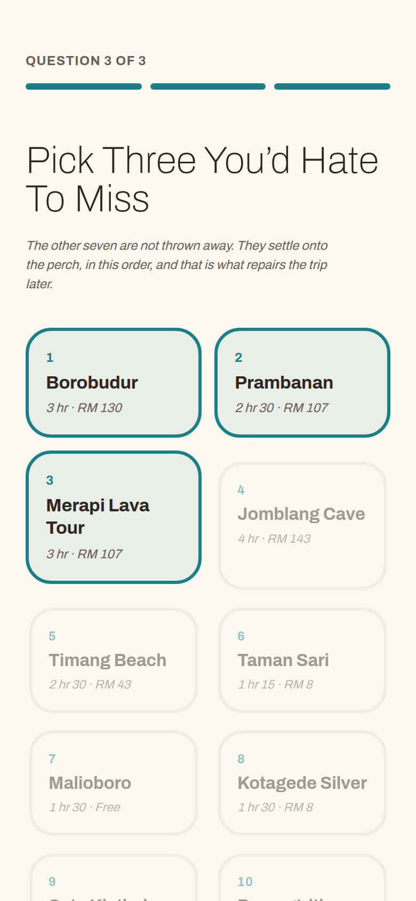
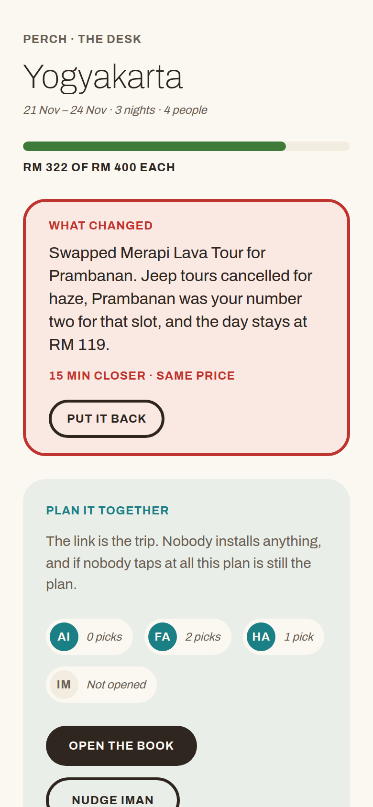
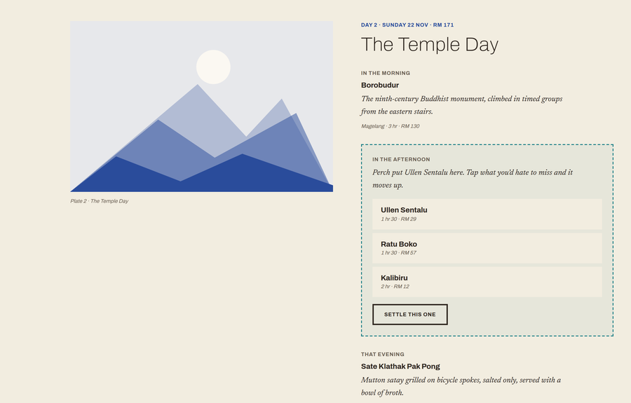
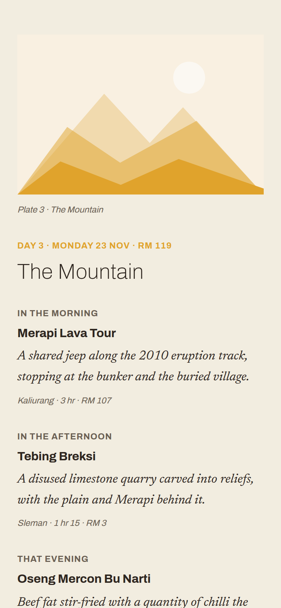

# CodeNection 2026, Lifestyle & Personal Productivity

Our entry to **CodeNection 2026**, organised by the Faculty of Computing and Informatics and co-organised by IT Society
MMU Cyberjaya. Team **TolongLabs**.

|                          |                                                                                               |
| ------------------------ | --------------------------------------------------------------------------------------------- |
| **Prototype submission** | 13 September 2026, 23:59 MYT, via the organisers' Google Form                                 |
| **Grand Finals**         | 15 November 2026, physical, venue to be announced                                             |
| **Track**                | Track 1: Lifestyle & Personal Productivity                                                    |
| **Problem statement**    | Not chosen. Stress & Workload Manager, or Travel Planner                                      |
| **Status**               | Prototype phase. Concept locked as **Perch**; the prototype is built and deploys to Cloud Run |

---

## The Rule That Shapes This Repo

> **Ideation is 25 percent of the prototype score, and all four of its bands grade evidence produced along the way** -
> mindmaps and problem trees, documented iterations **including the directions we dropped**, mentor feedback we acted
> on, and several distinct ideas compared before choosing.

None of that can be reconstructed on 13 September from a finished idea. It is built as the work happens, on the
[`research` branch](#the-research-branch).

---

## Start Here

| File                           | What's In It                                                                         |
| ------------------------------ | ------------------------------------------------------------------------------------ |
| [`brief.md`](brief.md)         | The whole competition: phases, rules, deliverables, judging, mentors, judges         |
| [`PRODUCT.md`](PRODUCT.md)     | **The spine.** Who Perch is for, the one sentence, the demo moment, the scope ladder |
| [`DESIGN.md`](DESIGN.md)       | The design system: the field-guide direction, palette, type, radius, motion          |
| [`../AGENTS.md`](../AGENTS.md) | Project instructions for agentic tools, and humans                                   |

Work in progress lives in the [Issues board](https://github.com/TolongLabs/codenection-dev/issues), not in a checklist
here.

### Design And Prototype

**Two Figma files and one running build.** The files are separate on purpose, and the reason is in the note below.

| File                                                                                                           | What Is In It                                                                                                   | Access                                     |
| -------------------------------------------------------------------------------------------------------------- | --------------------------------------------------------------------------------------------------------------- | ------------------------------------------ |
| [Perch - Prototype Wireframe](https://www.figma.com/design/54WzxphGf6z5qeCzOXZscK/Perch---Prototype-Wireframe) | Eight screens in greyscale, captioned per screen. Structure and behaviour, no visual direction                  | Link + password                            |
| [Perch - Visual Mockups](https://www.figma.com/design/lei5YdT1r8Dky1QjfwZGfY/Perch---Visual-Mockups)           | One page. The design system layer, the desktop plate, and three mobile screens against [`DESIGN.md`](DESIGN.md) | **Private. Must be shared before 13 Sept** |
| [The running prototype](https://prototype-yskhynz4la-as.a.run.app)                                             | The built app. Redeployed on every merge to `main`, see [Deployment](#deployment)                               | Public                                     |

**Greys are deliberate.** The wireframe was drawn before [`DESIGN.md`](DESIGN.md) existed so that structure could be
judged without visual direction leaking into it. The visual mockups are built separately, against `DESIGN.md`, so that a
structural problem and a styling problem never get argued about at the same time.

### The Prototype, Screen By Screen

**Seven screens from the running build, not a mockup.** Each was captured from the deployed prototype at the width it is
designed for: 390px for the phone, 1440px for the desk.

| Screen                                                               | What It Proves                                                                                                                                                                          |
| -------------------------------------------------------------------- | --------------------------------------------------------------------------------------------------------------------------------------------------------------------------------------- |
|   | **The bench is made here.** Three picks rank 1 to 3; the seven that lose do not disappear, they take ranks 4 to 10 and settle. Everything the product does later is spent on that order |
|               | **Perch has already chosen.** The whole trip exists before anyone is consulted, and each day carries its own bird tint so colour says which day you are on                              |
|                      | **Fit comes before rank, and the rows that fail say why.** Jomblang Cave is 25 minutes too far for this slot. Hiding that would hide the argument                                       |
|         | **The repair has already happened.** Nobody was asked. The delta is in two units, travel then money, because a swap that quietly adds forty minutes breaks the day it was meant to save |
|  | **What the group opens is a magazine with gaps, not a planner.** A tap moves an option up; it never edits a slot. Open a planner and four people who install nothing do not tap         |
|              | **The same object, finished.** Every slot resolved, every control gone, and a plate for each day. This is the half of the product worth keeping after the trip                          |
|               | **Two columns, not a dashboard.** The instrument gets wider above 1024px; it does not sprout a sidebar or a chart                                                                       |

**The Prototype Controls block in the bottom left is deliberate and is labelled as not part of the product.** A fixture
has nothing to observe, so the disruption has to be fired by hand. **A hidden timer would demo better and be less
honest**, and a judge who can fire it twice can check that the repair is computed rather than replayed.

**Both links must be viewable at submission**, along with everything else this file points at - the organisers' rule is
that every link in the README opens. The mockups file is not shared yet and flipping it is a deliberate action, tracked
alongside making the repo public in [issue #13](https://github.com/TolongLabs/codenection-dev/issues/13).

### Source Material From The Organisers

Verbatim, append-only. We cite these instead of relying on memory.

| File                                                                         | Source                                                          |
| ---------------------------------------------------------------------------- | --------------------------------------------------------------- |
| [`source/kickoff-day-transcript.md`](source/kickoff-day-transcript.md)       | Kick-Off Day recording, 30 Aug. Whisper transcript              |
| [`source/kickoff-day-slides.md`](source/kickoff-day-slides.md)               | Kick-Off Day deck, 30 slides. Authoritative on dates and rubric |
| [`source/problem-statements.md`](source/problem-statements.md)               | The two problem statements and the general stipulations         |
| [`source/prototype-judging-rubrics.md`](source/prototype-judging-rubrics.md) | The prototype rubric, band by band                              |
| [`source/submission-template.md`](source/submission-template.md)             | The organisers' README template and video outline               |

---

## The `research` Branch

**Ideation happens on a separate long-lived branch called `research`, and it is never merged into `main`.**

It is a plain-language working notebook with its own README, its own agent setup and no build tooling, so that someone
who does not write code can open it and be productive without reading `AGENTS.md`. It holds the idea log, competitor
scans, user research, mentor notes, mindmaps and the record of every direction we dropped.

`main` **reads** from it and **cites** it. `docs/PRODUCT.md`, `docs/PRD.md` and `docs/TRD.md` are written here, on
`main`, from what `research` established.

```bash
git fetch origin research
git show research:README.md                      # read a single file
git worktree add ../codenection-research research # or check it out alongside main
```

---

## Getting Started

```bash
bun install                  # dependencies and the husky git hooks
cp .env.example .env         # empty of keys today; the prototype calls nothing external
bun run dev                  # the prototype, on http://localhost:5173
```

| Command             | Does                                        |
| ------------------- | ------------------------------------------- |
| `bun run dev`       | Vite dev server                             |
| `bun run build`     | Production build into `dist/`               |
| `bun run preview`   | Serve that build on 8080, as Cloud Run does |
| `bun run lint`      | Biome check, then Prettier check            |
| `bun run format`    | Both formatters, writing in place           |
| `bun run typecheck` | `tsc --noEmit`                              |
| `gh issue list`     | The TODO board                              |

Biome covers JS, TS, JSON, CSS and HTML; Prettier covers the Markdown and YAML it cannot, wrapping prose at 120 to match
`biome.json`'s `lineWidth`. There is no `.prettierignore`, so every Markdown file is formatted, `docs/source/` and the
vendored skills included. Only the contents of fenced code blocks are left alone.

---

## How Work Ships

**`main` is PR-gated.** Branch as `<type>/<slug>`, open a PR with `gh pr create`, merge with
`gh pr merge --squash --delete-branch`. Anyone may merge, agents included - **the PR is there to make a change
reviewable and revertable, not to make it wait.** `research` is the exception and commits directly, because gating a
notebook defeats it.

**The gate is enforced client-side, for now.** GitHub only offers branch protection on a private repo under a paid plan,
so today the rule is held up by `.claude/hooks/guard-git.sh`, which blocks a direct or force push to `main`, and by the
deny list in `.claude/settings.json`. **That stops an agent, not a determined human.** Protection becomes free the
moment the repo goes public, which it must before submission anyway - tracked in
[issue #13](https://github.com/TolongLabs/codenection-dev/issues/13).

**Implementation is gated on three docs.** `PRODUCT.md` (who and why), `PRD.md` (what, and what is out of scope) and
`TRD.md` (how) must all exist before build work starts. `DESIGN.md` joins them when frontend work does. All three cite
`research`.

**The repo must be public at submission.** It is private today. Flipping it is a deliberate action someone takes before
13 September, and it is tracked as an issue.

---

## Layout

```
docs/
  README.md              this file. The submission surface, and the GitHub landing page
  brief.md               competition facts, the single source of truth
  PRODUCT.md             who, why, the demo moment
  PRD.md                 what: requirements, acceptance criteria, out of scope
  TRD.md                 how: architecture, contracts, schemas. Canonical
  DESIGN.md              the design system
  design/                the studies DESIGN.md is drawn from
  coding-guidelines.md   behavioural coding rules, referenced by AGENTS.md
  agent-tooling.md       rtk and graphify, both optional and per-machine
  source/                organiser material, append-only
  demo/                  video script, slides, assets
src/
  data/                  types, the place fixture, the seeded trip
  lib/                   repair, ranking, persistence, formatting
  surfaces/              Interview, Desk, Book
  components/            the perch drawer, state chip, What Changed, the plate
  styles/                tokens.css and base.css, the DESIGN.md system in CSS
index.html               the Vite entry
public/                  static assets copied verbatim: the mark and the self-hosted fonts
Dockerfile               two stages. Bun builds, nginx serves dist/ on 8080
nginx.conf               static config, with the SPA fallback the shared link needs
.github/workflows/       deploy.yml, which builds and ships on every merge
.agents/skills/          36 skills, the committed source of truth
.claude/skills/          symlinks into .agents/skills/, plus impeccable as a real dir
.claude/agents/          pitch-smith
.claude/hooks/           session brief, env drift, git guard, formatter
```

All four of `PRODUCT.md`, `PRD.md`, `TRD.md` and `DESIGN.md` exist. `TRD.md` is canonical on anything under `src/`.

Skill provenance and what each hook does: [`../.agents/skills/VENDORED.md`](../.agents/skills/VENDORED.md).

## Deployment

**The prototype is served from Cloud Run, and every merge to `main` redeploys it** - whoever pushed. No manual deploy
step, and no one person holding the keys, which is why this is not on Vercel: Vercel's Hobby tier only builds commits
authored by the account owner, so teammates could not ship.

|                      |                                                                                                                          |
| -------------------- | ------------------------------------------------------------------------------------------------------------------------ |
| **Live**             | [prototype-yskhynz4la-as.a.run.app](https://prototype-yskhynz4la-as.a.run.app)                                           |
| **What gets served** | Everything under `public/`, including subdirectories and assets                                                          |
| **Trigger**          | Any push to `main`. **There is no path filter on purpose** - a filter means a change lands and nothing happens, silently |
| **Auth**             | Workload Identity Federation. **No service-account key exists**, in the repo or in GitHub Secrets                        |
| **Project**          | `codenection-2026`, region `asia-southeast1`                                                                             |

**The prototype is built, not copied.** The first stage of `Dockerfile` runs `bun run build` and nginx serves the
resulting `dist/`, so the workflow never needed changing - it still just runs `docker build .`. **`public/` is now
Vite's static asset folder**, holding the mark and the self-hosted fonts, and everything else comes from `src/`.

**The shared link needs the SPA fallback.** `/t/<trip>` is a real path with no file behind it, so `nginx.conf` falls
every unknown path back to `index.html`. Delete that line and the link at the centre of the product returns a 404.

**Biome lints `src/`**, CSS included. `bun run lint` and `bun run typecheck` both pass on `main`, and a PR that breaks
either is a PR that breaks the deploy.

---

**This README is the submission.** Asked at Kick-Off Day what the submission format is, the organisers answered that the
Google Form takes a public repo URL and _"everything must live in the README of your repo - project overview, a link to
your visual presentation, your ideation and process assets, and your design and prototype artifacts."_

It lives in `docs/` rather than the repo root, and still renders as the repository landing page: **GitHub surfaces a
README from the root, `.github/` or `docs/`.** Keeping it here keeps the root uncluttered and the docs together. **There
is exactly one README and this is it**, so keep its links relative to `docs/`.

**The organisers publish a template for it**, transcribed at
[`source/submission-template.md`](source/submission-template.md). It is a recommendation rather than a rule, but its
five numbered sections line up with the rubric, so this file grows into that shape rather than a shape of our own. What
it prescribes that is easy to miss is summarised in [`brief.md`](brief.md#the-submission-template).
